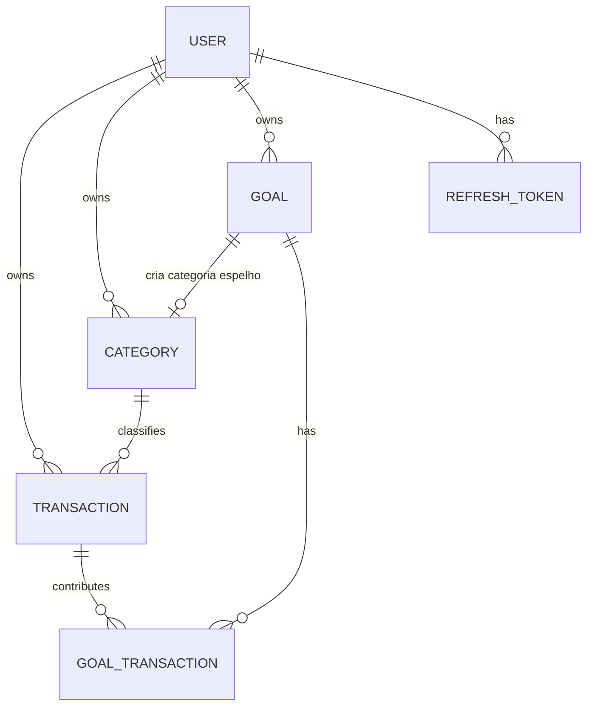
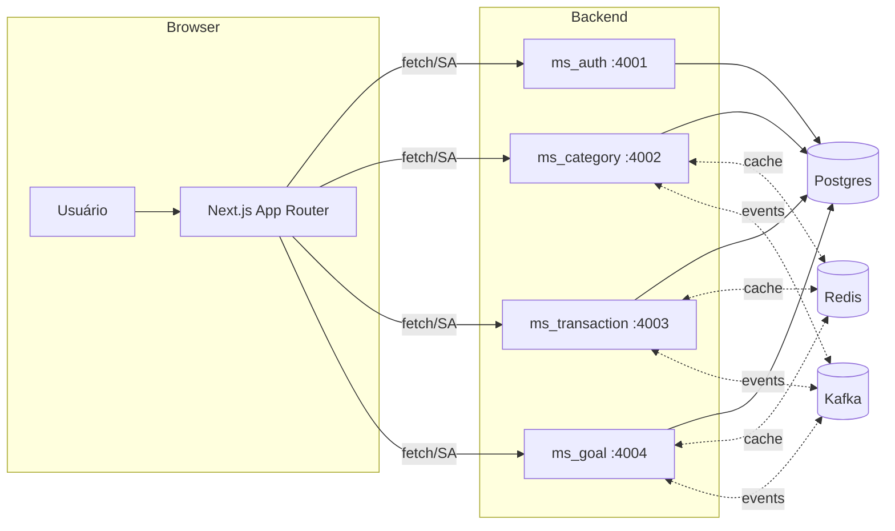
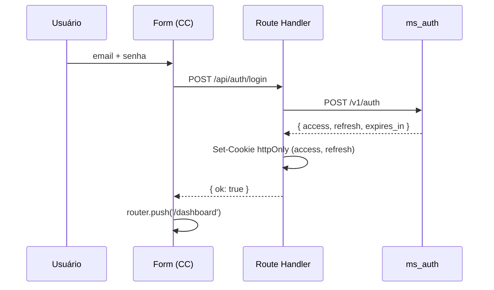
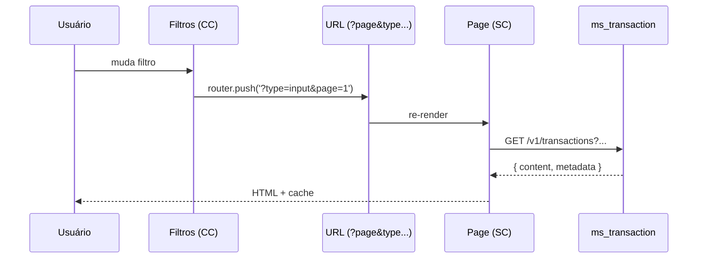
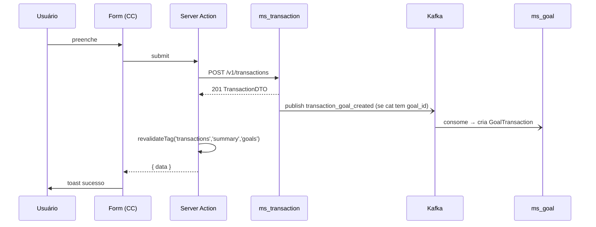
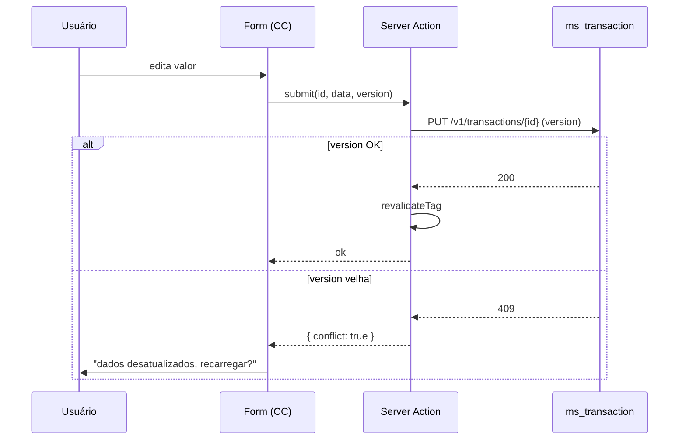

# `docs/api-guide.md` — Guia de Integração Next.js ↔ API Go

> **Projeto**: Minhas Finanças — API de finanças pessoais em microsserviços
> **Público-alvo**: time de frontend Next.js (App Router)
> **Versão do guia**: 1.4 (erros, metadata, goal report confirmados + design system Tailwind)

---

## 1. Visão Geral do Sistema

### 1.1 Domínio
Aplicação de **gestão financeira pessoal**. O usuário registra transações (entradas/saídas), organiza em categorias, cria metas financeiras com progresso automático e consulta relatórios de balanço.

### 1.2 Entidades e relacionamentos



- `USER` — identidade e autenticação
- `CATEGORY` — classifica transações como `input` (entrada) ou `output` (saída). Pode estar vinculada a uma `GOAL`
- `TRANSACTION` — movimentação financeira com categoria obrigatória
- `GOAL` — meta com valor-alvo, deadline e status
- `GOAL_TRANSACTION` — vínculo N:N entre metas e transações (quando categoria tem `goal_id`)
- `REFRESH_TOKEN` — controle de sessão com family (rotação)

### 1.3 Fluxo de dados



---

## 2. Autenticação e Autorização

### 2.1 Fluxo completo

1. **Signup** → `POST /v1/users` (sem retornar token)
2. **Login** → `POST /v1/auth` retorna `{ access_token, refresh_token, expires_in }`
3. **Requisições protegidas** → `Authorization: Bearer <access_token>`
4. **Expiração do access** → `POST /v1/auth/refresh` com `refresh_token` gera novo par
5. **Logout** → `POST /v1/auth/logout` revoga toda a família de refresh tokens

### 2.2 Onde o token viaja

| Token | Onde guardar no front | Por quê |
|---|---|---|
| `access_token` | **cookie httpOnly** ou memória do Server | Nunca no `localStorage` — XSS |
| `refresh_token` | **cookie httpOnly** (Set-Cookie) | Longa duração, alta sensibilidade |

**Recomendação para App Router**:

- Criar **Route Handler** `/api/auth/login` que recebe credenciais → chama `ms_auth` → **seta cookies httpOnly** → retorna 200 pro cliente.
- Criar `/api/auth/refresh` que lê o cookie de refresh → chama `ms_auth` → atualiza cookies.
- Criar `/api/auth/logout` que limpa cookies + revoga no backend.

> **Por que httpOnly > localStorage?**
> `localStorage` é acessível por qualquer JS na página. Um XSS (dependência comprometida, `dangerouslySetInnerHTML`, etc) consegue exfiltrar o token. Cookie httpOnly não é lido por JS — mitiga XSS. O custo: precisa de proteção CSRF (SameSite=Lax/Strict + token CSRF em mutações).

### 2.3 Refresh token rotation

O backend usa **refresh token family**: cada refresh gera novo refresh e marca o antigo como revogado. Se um refresh **já revogado** for usado novamente (indício de roubo), **toda a família é revogada** — usuário precisa logar de novo.

**Implicação pro front**:
- Faça refresh **serializado** (uma promise global) — refresh paralelos com o mesmo token disparam a revogação em cascata.
- Trate 401 no access → tente refresh **uma vez** → se falhar, redirecione pro login.

### 2.4 Autorização

- Rotas públicas: `/v1/auth/*`, `POST /v1/users`, `/health`, `/metrics`
- Todas as demais exigem `RequireActivatedUser` — **usuário com `activated=false` recebe 403** mesmo com token válido
- Não há roles — é single-user por token

---

## 3. Convenções da API

### 3.1 Base URL

Cada microserviço tem sua própria porta. **Não há API Gateway**.

```env
# .env.local (server-only, SEM NEXT_PUBLIC_)
AUTH_URL=http://localhost:4001
CATEGORY_URL=http://localhost:4002
TRANSACTION_URL=http://localhost:4003
GOAL_URL=http://localhost:4004
```

> ⚠️ **Não use `NEXT_PUBLIC_`** — expõe as URLs do backend no bundle do cliente. O front só fala com suas próprias rotas `/api/*` (BFF), que por sua vez falam com o backend.
>
> Em produção, recomendo um **reverse proxy** (Nginx/Traefik) com prefixo por serviço (`/auth`, `/category`...) para o front consumir uma origem única. Isso simplifica CORS e cookies.

### 3.2 Envelope de resposta

**Listas** sempre embrulhadas:
```json
{
  "content": [ ... ],
  "metadata": {
    "current_page": 1,
    "page_size": 20,
    "first_page": 1,
    "last_page": 5,
    "total_records": 100
  }
}
```

**Shape confirmado** (`shared/utils/filters/filters.go`):

```go
type Metadata struct {
    CurrentPage  int `json:"current_page,omitempty"`
    PageSize     int `json:"page_size,omitempty"`
    FirstPage    int `json:"first_page,omitempty"`
    LastPage     int `json:"last_page,omitempty"`
    TotalRecords int `json:"total_records,omitempty"`
}
```

> ⚠️ **GOTCHA — todos os campos têm `omitempty`**: quando **não há registros** (`totalRecords == 0`), o backend retorna `CalculateMetadata` com `Metadata{}` — ou seja, **`metadata` vem como `{}` vazio**.
>
> Consequência pro front: **nunca assuma que `metadata.current_page` existe**. Ou trate `metadata` como `Partial<PaginationMetadata>`, ou normalize no wrapper de fetch. Exemplo de acesso seguro:
> ```ts
> const lastPage = metadata.last_page ?? 1;
> const total = metadata.total_records ?? 0;
> ```

**Item único**: objeto direto (sem envelope).

### 3.3 Paginação

| Param | Default | Limite | Descrição |
|---|---|---|---|
| `page` | `1` | `1` a `10.000.000` | Página atual |
| `page_size` | `20` | `1` a `100` | Itens por página |
| `sort` | `id` | — | Campo + direção (`-` = DESC). Safelist por recurso |
| `search` | `""` | — | Busca textual (nem todo endpoint tem) |

> ⚠️ **Violações retornam 422** com `errors` contendo `{ page: "must be greater than zero" }` etc.

**Sorts suportados por recurso** (das safelists vistas no código):

| Recurso | Sorts permitidos |
|---|---|
| `users` | `id`, `name`, `-id`, `-name` |
| `categories` | `id`, `name`, `-id`, `-name` |
| `transactions` | `id`, `amount`, `-id`, `-amount` |
| `goals` | `id`, `name`, `-id`, `-name` |
| `goals_transactions` | `id`, `name`, `-id`, `-name` |

### 3.4 Formato de erros

O backend tem **dois formatos distintos** de erro. Isso é crucial pro front.

#### 3.4.1 Erros gerais (HTTPError)

Retornado por qualquer erro de domínio (`ErrRecordNotFound`, `ErrInvalidCredentials`, `ErrEditConflict`, etc) e por 404/405 globais.

```json
{
  "path": "/v1/auth",
  "status": "Unauthorized",
  "message": "invalid authentication credentials"
}
```

| Campo | Tipo | Descrição |
|---|---|---|
| `path` | string | Path da requisição (`r.URL.Path`) |
| `status` | string | **Texto** do status HTTP (`http.StatusText`): `"Not Found"`, `"Unauthorized"`, `"Conflict"` |
| `message` | string | Mensagem legível (do `PublicMessage()`) |

> ⚠️ **`status` é uma string legível, NÃO um número.** O código numérico vem no header HTTP. Front precisa ler `response.status` do `fetch`, não o body.

#### 3.4.2 Erros de validação (422 Unprocessable Entity)

Retornado quando um campo falha na validação (via `ValidationError`).

```json
{
  "path": "/v1/users",
  "status": "Unprocessable Entity",
  "message": "validation failed",
  "errors": {
    "email": "must be a valid email address",
    "password": "must be at least 8 bytes long",
    "name": "must be at least 3 characters long"
  }
}
```

| Campo | Tipo | Descrição |
|---|---|---|
| `path` | string | Path da requisição |
| `status` | string | Sempre `"Unprocessable Entity"` |
| `message` | string | Sempre `"validation failed"` |
| `errors` | `Record<string, string>` | **Mapa campo → mensagem** (não é `details`!) |

> ⚠️ **Validação NÃO é 400 — é 422.** Isso vale para:
> - Body inválido em `POST/PUT` (senha curta, email inválido, etc)
> - Query params inválidos em listagens (ex: `sort` fora da safelist, `page_size > 100`)
> - **Constraint de negócio**: `ValidationAlreadyExists` (ex: `transactions_user_id_category_id_key` → `{ "category_id": "a record with this category_id already exists" }`)

#### 3.4.3 Códigos HTTP usados no backend

| Código | Quando | Corpo |
|---|---|---|
| `400` | JSON malformado / bad request genérico | HTTPError shape |
| `401` | Credenciais inválidas, token ausente/expirado/malformado | HTTPError shape |
| `403` | Conta inativa, sem permissão | HTTPError shape |
| `404` | Recurso não encontrado (inclui rota inexistente) | HTTPError shape |
| `405` | Método não permitido | HTTPError shape |
| `409` | `ErrEditConflict` (versão desatualizada) | HTTPError shape |
| `422` | **Validação** (fields) OU **constraint de unicidade** | ValidationError shape |
| `429` | Rate limit | HTTPError shape |
| `500` | Erro interno | HTTPError shape genérica |
| `504` | Timeout | HTTPError shape |

### 3.5 CORS

Aplicado dentro de `/v1` via middleware `EnableCORS`. Configurar origens permitidas no `.env` do backend para incluir `http://localhost:3000`.

---

## 4. Catálogo de Endpoints

> **Legenda**: SC = Server Component · SA = Server Action · RH = Route Handler · CC = Client Component

### 4.1 `ms_auth` (porta 4001)

---

#### `POST /v1/auth` — Login

**Caso de uso**: autenticar e obter tokens.

**Body**:
```json
{ "email": "user@example.com", "password": "Senha123A" }
```

**Response 200**:
```json
{
  "access_token": "eyJ...",
  "refresh_token": "eyJ...",
  "expires_in": 900
}
```

**Erros**:
- `400` — JSON malformado (falha no `ReadJSON`)
- `401` — `ErrInvalidCredentials` → `{ path, status: "Unauthorized", message: "invalid authentication credentials" }`
- `403` — `ErrInactiveAccount` → `{ path, status: "Forbidden", message: "your user account must be activated to access this resource" }`

**Snippet Next.js** — Route Handler como BFF:
```ts
// src/app/api/auth/login/route.ts
import { cookies } from 'next/headers';

export async function POST(req: Request) {
  const body = await req.json();
  const res = await fetch(`${process.env.AUTH_URL}/v1/auth`, {
    method: 'POST',
    headers: { 'Content-Type': 'application/json' },
    body: JSON.stringify(body),
  });
  if (!res.ok) return new Response(await res.text(), { status: res.status });

  const data = await res.json();
  const jar = await cookies();
  jar.set('access_token', data.access_token, {
    httpOnly: true, secure: true, sameSite: 'lax', path: '/',
    maxAge: data.expires_in,
  });
  jar.set('refresh_token', data.refresh_token, {
    httpOnly: true, secure: true, sameSite: 'lax', path: '/',
    maxAge: 60 * 60 * 24 * 30,
  });
  return Response.json({ ok: true });
}
```

**Por que assim?** O cliente nunca vê o token — evita XSS. O cookie httpOnly trafega automaticamente nas próximas chamadas via Server Components/Actions. Trade-off: precisa de middleware pra evitar CSRF.

**Snippet Next.js — Página de login (visual completo)**:
```tsx
// src/app/(auth)/login/page.tsx
import { LoginForm } from './login-form';

export default function LoginPage() {
  return (
    <main className="min-h-screen flex items-center justify-center bg-gradient-to-br from-slate-50 to-slate-100 p-4">
      <div className="w-full max-w-md">
        <div className="rounded-2xl border border-slate-200 bg-white p-8 shadow-xl">
          <div className="mb-8 text-center">
            <div className="mx-auto mb-4 flex h-14 w-14 items-center justify-center rounded-2xl bg-gradient-to-br from-emerald-400 to-teal-500 shadow-md">
              <span className="text-xl font-bold text-white">MF</span>
            </div>
            <h1 className="text-2xl font-bold tracking-tight text-slate-900">
              Minhas Finanças
            </h1>
            <p className="mt-1 text-sm text-slate-500">
              Entre para gerenciar suas finanças
            </p>
          </div>
          <LoginForm />
        </div>
        <p className="mt-6 text-center text-xs text-slate-400">
          Não tem conta?{' '}
          <a
            href="/signup"
            className="font-medium text-emerald-600 hover:text-emerald-700 hover:underline"
          >
            Cadastre-se
          </a>
        </p>
      </div>
    </main>
  );
}
```

```tsx
// src/app/(auth)/login/login-form.tsx
'use client';

import { useState, useTransition } from 'react';
import { useRouter } from 'next/navigation';
import type { HttpErrorResponse, ValidationErrorResponse } from '@/types/api';

type ApiError = HttpErrorResponse | ValidationErrorResponse;

export function LoginForm() {
  const router = useRouter();
  const [isPending, startTransition] = useTransition();
  const [error, setError] = useState<string | null>(null);
  const [fieldErrors, setFieldErrors] = useState<Record<string, string>>({});
  const [showPassword, setShowPassword] = useState(false);

  async function handleSubmit(e: React.SyntheticEvent<HTMLFormElement>) {
    e.preventDefault();
    setError(null);
    setFieldErrors({});

    const formData = new FormData(e.currentTarget);
    const payload = {
      email: String(formData.get('email') ?? ''),
      password: String(formData.get('password') ?? ''),
    };

    startTransition(async () => {
      const res = await fetch('/api/auth/login', {
        method: 'POST',
        headers: { 'Content-Type': 'application/json' },
        body: JSON.stringify(payload),
      });

      if (res.ok) {
        router.push('/dashboard');
        router.refresh();
        return;
      }

      const body = (await res.json()) as ApiError;
      if ('errors' in body && body.errors) {
        setFieldErrors(body.errors);
        setError(body.message ?? 'Erro de validação');
      } else {
        setError(body.message ?? 'Falha no login');
      }
    });
  }

  return (
    <form onSubmit={handleSubmit} className="space-y-5">
      {/* EMAIL */}
      <div>
        <label
          htmlFor="email"
          className="mb-1.5 block text-sm font-medium text-slate-700"
        >
          Email
        </label>
        <input
          id="email"
          name="email"
          type="email"
          required
          autoComplete="email"
          disabled={isPending}
          placeholder="seu@email.com"
          className="w-full rounded-lg border border-slate-300 bg-white px-3 py-2.5 text-slate-900 placeholder:text-slate-400 transition-all duration-150 focus:outline-none focus:border-emerald-500 focus:ring-2 focus:ring-emerald-500/20 disabled:opacity-60 disabled:cursor-not-allowed"
        />
        {fieldErrors.email && (
          <p className="mt-1.5 flex items-center gap-1 text-xs text-red-600">
            <span aria-hidden>⚠</span>
            {fieldErrors.email}
          </p>
        )}
      </div>

      {/* SENHA */}
      <div>
        <div className="mb-1.5 flex items-center justify-between">
          <label
            htmlFor="password"
            className="block text-sm font-medium text-slate-700"
          >
            Senha
          </label>
          <a
            href="#"
            className="text-xs text-emerald-600 hover:text-emerald-700 hover:underline"
          >
            Esqueceu?
          </a>
        </div>
        <div className="relative">
          <input
            id="password"
            name="password"
            type={showPassword ? 'text' : 'password'}
            required
            autoComplete="current-password"
            disabled={isPending}
            placeholder="••••••••"
            className="w-full rounded-lg border border-slate-300 bg-white pl-3 pr-10 py-2.5 text-slate-900 placeholder:text-slate-400 transition-all duration-150 focus:outline-none focus:border-emerald-500 focus:ring-2 focus:ring-emerald-500/20 disabled:opacity-60 disabled:cursor-not-allowed"
          />
          <button
            type="button"
            onClick={() => setShowPassword((v) => !v)}
            disabled={isPending}
            aria-label={showPassword ? 'Ocultar senha' : 'Mostrar senha'}
            className="absolute right-2 top-1/2 flex h-7 w-7 -translate-y-1/2 items-center justify-center rounded-md text-slate-400 transition-colors hover:bg-slate-100 hover:text-slate-600 focus:outline-none focus:ring-2 focus:ring-emerald-500/40 disabled:opacity-40 disabled:cursor-not-allowed"
          >
            {showPassword ? (
              <svg xmlns="http://www.w3.org/2000/svg" width="16" height="16" viewBox="0 0 24 24" fill="none" stroke="currentColor" strokeWidth="2" strokeLinecap="round" strokeLinejoin="round" aria-hidden="true">
                <path d="M9.88 9.88a3 3 0 1 0 4.24 4.24" />
                <path d="M10.73 5.08A10.43 10.43 0 0 1 12 5c7 0 10 7 10 7a13.16 13.16 0 0 1-1.67 2.68" />
                <path d="M6.61 6.61A13.526 13.526 0 0 0 2 12s3 7 10 7a9.74 9.74 0 0 0 5.39-1.61" />
                <line x1="2" y1="2" x2="22" y2="22" />
              </svg>
            ) : (
              <svg xmlns="http://www.w3.org/2000/svg" width="16" height="16" viewBox="0 0 24 24" fill="none" stroke="currentColor" strokeWidth="2" strokeLinecap="round" strokeLinejoin="round" aria-hidden="true">
                <path d="M2 12s3-7 10-7 10 7 10 7-3 7-10 7-10-7-10-7Z" />
                <circle cx="12" cy="12" r="3" />
              </svg>
            )}
          </button>
        </div>
        {fieldErrors.password && (
          <p className="mt-1.5 flex items-center gap-1 text-xs text-red-600">
            <span aria-hidden>⚠</span>
            {fieldErrors.password}
          </p>
        )}
      </div>

      {/* ERRO GERAL */}
      {error && (
        <div
          role="alert"
          className="flex items-start gap-2 rounded-lg border border-red-200 bg-red-50 px-3 py-2.5 text-sm text-red-700"
        >
          <span aria-hidden className="shrink-0">⚠</span>
          <span>{error}</span>
        </div>
      )}

      {/* BOTÃO */}
      <button
        type="submit"
        disabled={isPending}
        className="w-full rounded-lg bg-emerald-600 px-4 py-2.5 font-medium text-white shadow-sm transition-all duration-150 hover:bg-emerald-700 focus:outline-none focus:ring-2 focus:ring-emerald-500 focus:ring-offset-2 active:scale-[0.98] disabled:opacity-60 disabled:cursor-not-allowed disabled:active:scale-100"
      >
        {isPending ? 'Entrando…' : 'Entrar'}
      </button>
    </form>
  );
}
```

---

#### `POST /v1/auth/refresh` — Renovar tokens

**Body**: `{ "refresh_token": "eyJ..." }`
**Response 200**: igual ao login.

**Erros**:
- `400` — JSON malformado
- `400` — refresh token revogado → `{ path, status: "Bad Request", message: "refresh token has been revoked" }`
- `400` — refresh token expirado → `{ path, status: "Bad Request", message: "refresh token expired" }`
- `401` — token inválido (`ErrInvalidTokenType`, `ErrTokenExpired`, etc)

**Snippet Next.js** — Route Handler que lê cookie:
```ts
// src/app/api/auth/refresh/route.ts
import { cookies } from 'next/headers';

export async function POST() {
  const jar = await cookies();
  const refresh = jar.get('refresh_token')?.value;
  if (!refresh) return new Response('no refresh', { status: 401 });

  const res = await fetch(`${process.env.AUTH_URL}/v1/auth/refresh`, {
    method: 'POST',
    headers: { 'Content-Type': 'application/json' },
    body: JSON.stringify({ refresh_token: refresh }),
  });
  if (!res.ok) {
    jar.delete('access_token'); jar.delete('refresh_token');
    return new Response('refresh failed', { status: 401 });
  }
  const data = await res.json();
  jar.set('access_token', data.access_token, { httpOnly: true, secure: true, sameSite: 'lax', path: '/', maxAge: data.expires_in });
  jar.set('refresh_token', data.refresh_token, { httpOnly: true, secure: true, sameSite: 'lax', path: '/', maxAge: 60*60*24*30 });
  return Response.json({ ok: true });
}
```

**Por que assim?** O refresh é uma operação **serializada por natureza** (rotação de família). Fazer dentro de um Route Handler impede chamadas paralelas do client e facilita revogar tudo em caso de falha.

---

#### `POST /v1/auth/logout` — Logout

**Body**: `{ "refresh_token": "eyJ..." }`
**Response 204**.

**Snippet**: Route Handler que lê o cookie, chama o backend, e limpa cookies independente do resultado.

```ts
// src/app/api/auth/logout/route.ts
import { cookies } from 'next/headers';

export async function POST() {
  const jar = await cookies();
  const refresh = jar.get('refresh_token')?.value;

  if (refresh) {
    await fetch(`${process.env.AUTH_URL}/v1/auth/logout`, {
      method: 'POST',
      headers: { 'Content-Type': 'application/json' },
      body: JSON.stringify({ refresh_token: refresh }),
    }).catch(() => {});
  }

  jar.delete('access_token');
  jar.delete('refresh_token');
  return new Response(null, { status: 204 });
}
```

**Por que assim?** Mesmo que o backend falhe, o usuário deve ser deslogado localmente. Idempotência importa mais que consistência.

---

#### `POST /v1/users` — Cadastro

**Body**:
```json
{ "email": "user@example.com", "password": "Senha123A", "name": "João" }
```

**Response 201**:
```json
{ "id": "uuid", "email": "...", "name": "...", "version": 1 }
```

**Erros**:
- `400` — JSON malformado
- `422` — validação (senha ≥8 chars, com letra e número; nome 3–100 chars; email válido) → body com `errors: { campo: msg }`
- `422` — email duplicado (`ValidationAlreadyExists` → `errors: { email: "a record with this email already exists" }`)

**Snippet Next.js — Página de signup (visual completo)**:
```tsx
// src/app/(auth)/signup/page.tsx
import { SignUpForm } from './signup-form';

export default function SignUpPage() {
  return (
    <main className="min-h-screen flex items-center justify-center bg-gradient-to-br from-slate-50 to-slate-100 p-4">
      <div className="w-full max-w-md">
        <div className="rounded-2xl border border-slate-200 bg-white p-8 shadow-xl">
          <div className="mb-8 text-center">
            <div className="mx-auto mb-4 flex h-14 w-14 items-center justify-center rounded-2xl bg-gradient-to-br from-emerald-400 to-teal-500 shadow-md">
              <span className="text-xl font-bold text-white">MF</span>
            </div>
            <h1 className="text-2xl font-bold tracking-tight text-slate-900">
              Criar conta
            </h1>
            <p className="mt-1 text-sm text-slate-500">
              Comece a organizar suas finanças hoje
            </p>
          </div>
          <SignUpForm />
        </div>
        <p className="mt-6 text-center text-xs text-slate-400">
          Já tem conta?{' '}
          <a
            href="/login"
            className="font-medium text-emerald-600 hover:text-emerald-700 hover:underline"
          >
            Entrar
          </a>
        </p>
      </div>
    </main>
  );
}
```

```tsx
// src/app/(auth)/signup/signup-form.tsx
'use client';

import { useState, useTransition } from 'react';
import { useRouter } from 'next/navigation';
import type { HttpErrorResponse, ValidationErrorResponse } from '@/types/api';

type ApiError = HttpErrorResponse | ValidationErrorResponse;

export function SignUpForm() {
  const router = useRouter();
  const [isPending, startTransition] = useTransition();
  const [error, setError] = useState<string | null>(null);
  const [fieldErrors, setFieldErrors] = useState<Record<string, string>>({});

  async function handleSubmit(e: React.SyntheticEvent<HTMLFormElement>) {
    e.preventDefault();
    setError(null);
    setFieldErrors({});

    const fd = new FormData(e.currentTarget);
    const payload = {
      name: String(fd.get('name') ?? ''),
      email: String(fd.get('email') ?? ''),
      password: String(fd.get('password') ?? ''),
    };

    startTransition(async () => {
      const res = await fetch('/api/auth/signup', {
        method: 'POST',
        headers: { 'Content-Type': 'application/json' },
        body: JSON.stringify(payload),
      });

      if (res.ok) {
        router.push('/login?signup=ok');
        return;
      }

      const body = (await res.json()) as ApiError;
      if ('errors' in body && body.errors) {
        setFieldErrors(body.errors);
        setError(body.message ?? 'Erro de validação');
      } else {
        setError(body.message ?? 'Falha no cadastro');
      }
    });
  }

  const inputCls =
    'w-full rounded-lg border border-slate-300 bg-white px-3 py-2.5 text-slate-900 placeholder:text-slate-400 transition-all duration-150 focus:outline-none focus:border-emerald-500 focus:ring-2 focus:ring-emerald-500/20 disabled:opacity-60 disabled:cursor-not-allowed';
  const labelCls = 'mb-1.5 block text-sm font-medium text-slate-700';
  const errorCls = 'mt-1.5 flex items-center gap-1 text-xs text-red-600';

  return (
    <form onSubmit={handleSubmit} className="space-y-5">
      <div>
        <label htmlFor="name" className={labelCls}>Nome</label>
        <input id="name" name="name" type="text" required placeholder="João Silva"
          autoComplete="name" disabled={isPending} className={inputCls} />
        {fieldErrors.name && <p className={errorCls}><span aria-hidden>⚠</span>{fieldErrors.name}</p>}
      </div>

      <div>
        <label htmlFor="email" className={labelCls}>Email</label>
        <input id="email" name="email" type="email" required placeholder="seu@email.com"
          autoComplete="email" disabled={isPending} className={inputCls} />
        {fieldErrors.email && <p className={errorCls}><span aria-hidden>⚠</span>{fieldErrors.email}</p>}
      </div>

      <div>
        <label htmlFor="password" className={labelCls}>Senha</label>
        <input id="password" name="password" type="password" required placeholder="••••••••"
          autoComplete="new-password" disabled={isPending} className={inputCls} />
        <p className="mt-1.5 text-xs text-slate-500">
          Mínimo 8 caracteres, com letra e número.
        </p>
        {fieldErrors.password && <p className={errorCls}><span aria-hidden>⚠</span>{fieldErrors.password}</p>}
      </div>

      {error && (
        <div role="alert" className="flex items-start gap-2 rounded-lg border border-red-200 bg-red-50 px-3 py-2.5 text-sm text-red-700">
          <span aria-hidden className="shrink-0">⚠</span>
          <span>{error}</span>
        </div>
      )}

      <button type="submit" disabled={isPending}
        className="w-full rounded-lg bg-emerald-600 px-4 py-2.5 font-medium text-white shadow-sm transition-all duration-150 hover:bg-emerald-700 focus:outline-none focus:ring-2 focus:ring-emerald-500 focus:ring-offset-2 active:scale-[0.98] disabled:opacity-60 disabled:cursor-not-allowed disabled:active:scale-100">
        {isPending ? 'Criando…' : 'Criar conta'}
      </button>
    </form>
  );
}
```

---

#### `GET /v1/users` — Listar usuários

**Query**: `page`, `page_size`, `sort` (`id|name|-id|-name`), `search`.
**Response 200**: envelope com `UserDTO[]`.

**⚠️ Uso incomum no front** — provavelmente só pra admin. Se for app single-user, provavelmente não usa.

---

#### `PUT /v1/users/{id}` — Atualizar usuário

**Body**: `UserDTO` (parcial, campos são ponteiros).
**Response 200**: `UserDTO`.

**Erros**: `404`, `422` (validação), `409` (`ErrEditConflict` — ⚠️ **confirmar** se `UserRepository.Update` usa `version`).

---

#### `DELETE /v1/users/{id}` — Deletar usuário

**Response 204**.

---

### 4.2 `ms_category` (porta 4002)

---

#### `POST /v1/categories` — Criar categoria

**Body**:
```json
{
  "name": "Salário",
  "type": "input",
  "goal_id": "uuid"
}
```

**Response 201**:
```json
{
  "id": "uuid",
  "user_id": "uuid",
  "name": "Salário",
  "type": "input",
  "goal_id": null
}
```

**Erros**:
- `400` — JSON malformado
- `403` — sem permissão (conta inativa)
- `422` — validação (name 3–100 chars, type ∈ {input, output}, user_id obrigatório) → body com `errors`
- `422` — nome duplicado (`ValidationAlreadyExists`) → `errors: { name: "..." }`

**Snippet Next.js** — Server Action:
```ts
'use server';
import { cookies } from 'next/headers';
import { revalidateTag } from 'next/cache';

export async function createCategory(input: CreateCategoryInput) {
  const jar = await cookies();
  const res = await fetch(`${process.env.CATEGORY_URL}/v1/categories`, {
    method: 'POST',
    headers: {
      'Content-Type': 'application/json',
      Authorization: `Bearer ${jar.get('access_token')?.value}`,
    },
    body: JSON.stringify(input),
  });
  if (!res.ok) return { error: await res.json() };
  revalidateTag('categories');
  return { data: await res.json() };
}
```

**Por que assim?** Categoria é escrita que **invalida a lista** — `revalidateTag` limpa cache do Server Component que renderiza `/categories`.

---

#### `GET /v1/categories` — Listar

**Query**: `page`, `page_size`, `sort` (`id|name|-id|-name`), `search`.
**Response 200**: `{ content: CategoryDTO[], metadata: {...} }`.

**Snippet Next.js** — Server Component **com UI estilizada**:
```tsx
// src/app/(app)/categories/page.tsx
import { cookies } from 'next/headers';
import Link from 'next/link';

export default async function Page({
  searchParams,
}: {
  searchParams: Promise<{ page?: string; search?: string }>;
}) {
  const { page = '1', search = '' } = await searchParams;
  const jar = await cookies();
  const qs = new URLSearchParams({ page, page_size: '20', search });

  const res = await fetch(`${process.env.CATEGORY_URL}/v1/categories?${qs}`, {
    headers: { Authorization: `Bearer ${jar.get('access_token')?.value}` },
    next: { tags: ['categories'], revalidate: 30 },
  });
  const { content, metadata } = await res.json();

  return (
    <div className="mx-auto max-w-5xl space-y-6 p-6">
      {/* HEADER */}
      <header className="flex items-center justify-between">
        <div>
          <h1 className="text-2xl font-bold tracking-tight text-slate-900">
            Categorias
          </h1>
          <p className="mt-1 text-sm text-slate-500">
            {metadata.total_records ?? 0} categorias cadastradas
          </p>
        </div>
        <Link
          href="/categories/new"
          className="rounded-lg bg-emerald-600 px-4 py-2 font-medium text-white shadow-sm transition-colors hover:bg-emerald-700"
        >
          + Nova categoria
        </Link>
      </header>

      {/* LISTA */}
      {content.length === 0 ? (
        <div className="rounded-2xl border border-dashed border-slate-300 bg-white p-12 text-center">
          <p className="text-sm text-slate-500">Nenhuma categoria cadastrada.</p>
        </div>
      ) : (
        <ul className="divide-y divide-slate-200 overflow-hidden rounded-2xl border border-slate-200 bg-white shadow-sm">
          {content.map((c: any) => (
            <li
              key={c.id}
              className="flex items-center justify-between px-5 py-4 transition-colors hover:bg-slate-50"
            >
              <div className="flex items-center gap-3">
                <span
                  className={`inline-flex h-9 w-9 items-center justify-center rounded-full text-sm font-semibold ${
                    c.type === 'input'
                      ? 'bg-emerald-100 text-emerald-700'
                      : 'bg-rose-100 text-rose-700'
                  }`}
                  aria-hidden
                >
                  {c.type === 'input' ? '↑' : '↓'}
                </span>
                <div>
                  <p className="font-medium text-slate-900">{c.name}</p>
                  <p className="text-xs text-slate-500">
                    {c.type === 'input' ? 'Entrada' : 'Saída'}
                    {c.goal_id && ' • vinculada a meta'}
                  </p>
                </div>
              </div>
              <Link
                href={`/categories/${c.id}`}
                className="text-sm font-medium text-emerald-600 hover:text-emerald-700 hover:underline"
              >
                Editar
              </Link>
            </li>
          ))}
        </ul>
      )}
    </div>
  );
}
```

**Por que assim?** Server Component busca direto (sem estado de loading no client), cache curto de 30s + tag pra invalidar após mutations. A UI usa `divide-y` + `hover:bg-slate-50` — mais limpo que tabela para dados com poucos campos.

---

#### `GET /v1/categories/{id}` — Detalhe

**Response 200**: `CategoryDTO`.
**Erros**: `404`.

---

#### `PUT /v1/categories/{id}` — Atualizar

**Body**: `CategoryDTO` (parcial).
**Response 200**: `CategoryDTO`.

**Erros**: `404`, `422`.
**⚠️ Sem `version`** — sem controle de concorrência otimista aqui.

---

#### `DELETE /v1/categories/{id}` — Remover

**Response 204**.

**Erros**:
- `400` — se a categoria tiver `goal_id` → `{ path, status: "Bad Request", message: "Not possible delete goal in category service" }`
- `404`

**Side effects**: dispara evento Kafka `category_deleted` → ms_transaction apaga transações vinculadas.

**⚠️ UX crítica**: o front deve esconder o botão de deletar quando `goal_id != null`, ou mostrar um aviso claro.

**Snippet** — botão condicional:
```tsx
{c.goal_id == null ? (
  <button
    type="button"
    className="rounded-md px-2 py-1 text-xs font-medium text-rose-600 transition-colors hover:bg-rose-50"
  >
    Excluir
  </button>
) : (
  <span
    className="rounded-md bg-slate-100 px-2 py-1 text-xs text-slate-500"
    title="Esta categoria está vinculada a uma meta e não pode ser removida"
  >
    🔒 vinculada
  </span>
)}
```

---

### 4.3 `ms_transaction` (porta 4003)

---

#### `POST /v1/transactions` — Criar transação

**Body**:
```json
{
  "amount": 150.50,
  "category_id": "uuid",
  "description": "Almoço"
}
```

**Response 201**:
```json
{
  "id": "uuid",
  "amount": 150.50,
  "category_id": "uuid",
  "description": "Almoço",
  "version": 1,
  "created_at": "2026-09-17T12:00:00Z"
}
```

**Erros**:
- `400` — JSON malformado
- `422` — validação (amount > 0, category_id obrigatório, description ≤ 100 chars) → body com `errors`
- `422` — categoria já usada (`transactions_user_id_category_id_key` → `ValidationAlreadyExists` → `errors: { category_id: "a record with this category_id already exists" }`)
- `404` — categoria não existe (do `categoryClient.FindByID`)

> ⚠️ **Atenção**: o "categoria já usada" retorna **422, não 409** — é um `ValidationError`, não um `HTTPError`.
>
> ⚠️ **Regra de negócio não óbvia**: **uma categoria só pode ter UMA transação por usuário** (unique constraint). Vale confirmar com produto.

**Snippet Next.js** — Server Action:
```ts
'use server';
import { cookies } from 'next/headers';
import { revalidateTag } from 'next/cache';

export async function createTransaction(input: CreateTransactionInput) {
  const jar = await cookies();
  const res = await fetch(`${process.env.TRANSACTION_URL}/v1/transactions`, {
    method: 'POST',
    headers: { 'Content-Type': 'application/json', Authorization: `Bearer ${jar.get('access_token')?.value}` },
    body: JSON.stringify(input),
  });
  if (!res.ok) return { error: await res.json() };
  revalidateTag('transactions');
  revalidateTag('summary');
  return { data: await res.json() };
}
```

**Por que assim?** Duas tags porque criar transação invalida tanto a lista quanto o resumo (Summary agrega por categoria).

**Snippet Next.js — Form estilizado**:
```tsx
// src/app/(app)/transactions/new/transaction-form.tsx
'use client';

import { useState, useTransition } from 'react';
import { useRouter } from 'next/navigation';
import type { Category } from '@/types/api';

export function TransactionForm({ categories }: { categories: Category[] }) {
  const router = useRouter();
  const [isPending, startTransition] = useTransition();
  const [error, setError] = useState<string | null>(null);
  const [fieldErrors, setFieldErrors] = useState<Record<string, string>>({});

  async function handleSubmit(e: React.SyntheticEvent<HTMLFormElement>) {
    e.preventDefault();
    setError(null);
    setFieldErrors({});

    const fd = new FormData(e.currentTarget);
    const payload = {
      amount: Number(fd.get('amount')),
      category_id: String(fd.get('category_id') ?? ''),
      description: String(fd.get('description') ?? ''),
    };

    startTransition(async () => {
      const res = await fetch('/api/proxy/transactions', {
        method: 'POST',
        headers: { 'Content-Type': 'application/json' },
        body: JSON.stringify(payload),
      });
      if (res.ok) {
        router.push('/transactions');
        router.refresh();
        return;
      }
      const body = await res.json();
      if ('errors' in body && body.errors) {
        setFieldErrors(body.errors);
        setError(body.message ?? 'Erro de validação');
      } else {
        setError(body.message ?? 'Erro ao salvar');
      }
    });
  }

  const inputCls =
    'w-full rounded-lg border border-slate-300 bg-white px-3 py-2.5 text-slate-900 placeholder:text-slate-400 transition-all duration-150 focus:outline-none focus:border-emerald-500 focus:ring-2 focus:ring-emerald-500/20 disabled:opacity-60 disabled:cursor-not-allowed';
  const labelCls = 'mb-1.5 block text-sm font-medium text-slate-700';

  return (
    <form
      onSubmit={handleSubmit}
      className="space-y-5 rounded-2xl border border-slate-200 bg-white p-6 shadow-sm"
    >
      <div>
        <label htmlFor="amount" className={labelCls}>Valor</label>
        <div className="relative">
          <span className="pointer-events-none absolute left-3 top-1/2 -translate-y-1/2 text-slate-400">
            R$
          </span>
          <input
            id="amount"
            name="amount"
            type="number"
            step="0.01"
            min="0.01"
            required
            disabled={isPending}
            placeholder="0,00"
            className={`${inputCls} pl-10`}
          />
        </div>
        {fieldErrors.amount && (
          <p className="mt-1.5 flex items-center gap-1 text-xs text-red-600">
            <span aria-hidden>⚠</span>
            {fieldErrors.amount}
          </p>
        )}
      </div>

      <div>
        <label htmlFor="category_id" className={labelCls}>Categoria</label>
        <select id="category_id" name="category_id" required disabled={isPending} className={inputCls}>
          <option value="">Selecione…</option>
          {categories.map((c) => (
            <option key={c.id} value={c.id ?? ''}>
              {c.name} ({c.type === 'input' ? 'entrada' : 'saída'})
            </option>
          ))}
        </select>
        {fieldErrors.category_id && (
          <p className="mt-1.5 flex items-center gap-1 text-xs text-red-600">
            <span aria-hidden>⚠</span>
            {fieldErrors.category_id}
          </p>
        )}
      </div>

      <div>
        <label htmlFor="description" className={labelCls}>Descrição</label>
        <input
          id="description"
          name="description"
          type="text"
          maxLength={100}
          required
          disabled={isPending}
          placeholder="Almoço no restaurante"
          className={inputCls}
        />
        {fieldErrors.description && (
          <p className="mt-1.5 flex items-center gap-1 text-xs text-red-600">
            <span aria-hidden>⚠</span>
            {fieldErrors.description}
          </p>
        )}
      </div>

      {error && (
        <div
          role="alert"
          className="flex items-start gap-2 rounded-lg border border-red-200 bg-red-50 px-3 py-2.5 text-sm text-red-700"
        >
          <span aria-hidden className="shrink-0">⚠</span>
          <span>{error}</span>
        </div>
      )}

      <div className="flex items-center justify-end gap-3 pt-2">
        <button
          type="button"
          onClick={() => router.back()}
          disabled={isPending}
          className="rounded-lg px-4 py-2.5 text-sm font-medium text-slate-700 transition-colors hover:bg-slate-100 disabled:opacity-60"
        >
          Cancelar
        </button>
        <button
          type="submit"
          disabled={isPending}
          className="rounded-lg bg-emerald-600 px-4 py-2.5 text-sm font-medium text-white shadow-sm transition-all duration-150 hover:bg-emerald-700 focus:outline-none focus:ring-2 focus:ring-emerald-500 focus:ring-offset-2 active:scale-[0.98] disabled:opacity-60 disabled:cursor-not-allowed disabled:active:scale-100"
        >
          {isPending ? 'Salvando…' : 'Salvar'}
        </button>
      </div>
    </form>
  );
}
```

---

#### `GET /v1/transactions` — Listar com filtros

**Query params**:

| Param | Tipo | Descrição |
|---|---|---|
| `page` | int | default 1 |
| `page_size` | int | default 20 (máx 100) |
| `sort` | string | `id \| amount \| -id \| -amount` |
| `start_date` | date | filtro `created_at >=` |
| `end_date` | date | filtro `created_at <=` |
| `category_id` | uuid | filtro |
| `type` | `input\|output` | ⚠️ erro do backend menciona "entrada/saida", mas o parse aceita `"input"`/`"output"` |

**Response 200**:
```json
{
  "content": [ "TransactionDTO", "..." ],
  "metadata": { "current_page": 1, "total_records": 42, "...": "..." }
}
```

**Erros**: `422` (query inválida — ex: sort fora da safelist, page_size > 100).

**Snippet Next.js — Server Component com UI estilizada**:
```tsx
// src/app/(app)/transactions/page.tsx
import { cookies } from 'next/headers';
import Link from 'next/link';

export default async function Page({
  searchParams,
}: {
  searchParams: Promise<Record<string, string | string[]>>;
}) {
  const sp = await searchParams;
  const params = new URLSearchParams(sp as Record<string, string>);
  const jar = await cookies();

  const res = await fetch(`${process.env.TRANSACTION_URL}/v1/transactions?${params}`, {
    headers: { Authorization: `Bearer ${jar.get('access_token')?.value}` },
    next: { tags: ['transactions'] },
  });
  const { content, metadata } = await res.json();

  return (
    <div className="mx-auto max-w-6xl space-y-6 p-6">
      {/* HEADER */}
      <header className="flex items-center justify-between">
        <div>
          <h1 className="text-2xl font-bold tracking-tight text-slate-900">
            Transações
          </h1>
          <p className="mt-1 text-sm text-slate-500">
            {metadata.total_records ?? 0} registros
          </p>
        </div>
        <Link
          href="/transactions/new"
          className="rounded-lg bg-emerald-600 px-4 py-2 font-medium text-white shadow-sm transition-colors hover:bg-emerald-700"
        >
          + Nova transação
        </Link>
      </header>

      {/* FILTROS (CC) */}
      <TransactionFilters />

      {/* TABELA */}
      {content.length === 0 ? (
        <div className="rounded-2xl border border-dashed border-slate-300 bg-white p-12 text-center">
          <p className="text-sm text-slate-500">Nenhuma transação encontrada.</p>
        </div>
      ) : (
        <div className="overflow-hidden rounded-2xl border border-slate-200 bg-white shadow-sm">
          <table className="w-full">
            <thead className="bg-slate-50 text-left text-xs font-semibold uppercase tracking-wide text-slate-500">
              <tr>
                <th className="px-5 py-3">Descrição</th>
                <th className="px-5 py-3">Categoria</th>
                <th className="px-5 py-3 text-right">Valor</th>
                <th className="px-5 py-3">Data</th>
                <th className="px-5 py-3"></th>
              </tr>
            </thead>
            <tbody className="divide-y divide-slate-100">
              {content.map((t: any) => (
                <tr key={t.id} className="transition-colors hover:bg-slate-50">
                  <td className="px-5 py-4 font-medium text-slate-900">
                    {t.description}
                  </td>
                  <td className="px-5 py-4 text-sm text-slate-600">
                    {t.category_id}
                  </td>
                  <td className={`px-5 py-4 text-right font-semibold ${
                    t.amount > 0 ? 'text-emerald-600' : 'text-rose-600'
                  }`}>
                    {new Intl.NumberFormat('pt-BR', {
                      style: 'currency',
                      currency: 'BRL',
                    }).format(t.amount)}
                  </td>
                  <td className="px-5 py-4 text-sm text-slate-500">
                    {new Date(t.created_at).toLocaleDateString('pt-BR')}
                  </td>
                  <td className="px-5 py-4 text-right">
                    <Link
                      href={`/transactions/${t.id}`}
                      className="text-sm font-medium text-emerald-600 hover:text-emerald-700 hover:underline"
                    >
                      Editar
                    </Link>
                  </td>
                </tr>
              ))}
            </tbody>
          </table>
        </div>
      )}

      <Pagination meta={metadata} />
    </div>
  );
}
```

**Por que assim?** Filtros na URL → compartilhável, bookmarks funcionam, e o Server Component re-renderiza automaticamente. Trade-off: UX de filtro com debounce precisa de Client Component paralelo.

**Snippet — componente `<Pagination />` estilizado**:
```tsx
// src/components/pagination.tsx
import Link from 'next/link';
import type { PaginationMetadata } from '@/types/api';

export function Pagination({ meta }: { meta: Partial<PaginationMetadata> }) {
  const current = meta.current_page ?? 1;
  const last = meta.last_page ?? 1;
  if (last <= 1) return null;

  const pages = Array.from({ length: last }, (_, i) => i + 1).filter(
    (p) => p === 1 || p === last || Math.abs(p - current) <= 1,
  );

  return (
    <nav
      aria-label="Paginação"
      className="flex items-center justify-center gap-1"
    >
      {pages.map((p, i) => {
        const prev = pages[i - 1];
        const gap = prev != null && p - prev > 1;
        return (
          <span key={p} className="flex items-center gap-1">
            {gap && <span className="px-2 text-slate-400">…</span>}
            <Link
              href={`?page=${p}`}
              aria-current={p === current ? 'page' : undefined}
              className={`min-w-[2.25rem] rounded-lg px-3 py-1.5 text-center text-sm font-medium transition-colors ${
                p === current
                  ? 'bg-emerald-600 text-white'
                  : 'text-slate-700 hover:bg-slate-100'
              }`}
            >
              {p}
            </Link>
          </span>
        );
      })}
    </nav>
  );
}
```

---

#### `GET /v1/transactions/{id}` — Detalhe

**Response 200**: `TransactionDTO`.
**Erros**: `404`.

---

#### `GET /v1/transactions/summary` — Resumo financeiro

**Query**: `start_date`, `end_date`, `category_id`, `type`.

**Response 200**:
```json
{
  "period": { "start_date": "2026-01-01", "end_date": "2026-09-17" },
  "total": 5000.00,
  "total_input": 6000.00,
  "total_output": 1000.00,
  "balance": 5000.00,
  "count": 42,
  "by_category": [
    { "category_id": "uuid", "category_name": "Salário", "type": "input", "total": 6000, "count": 1 },
    { "category_id": "uuid", "category_name": "Mercado", "type": "output", "total": 1000, "count": 41 }
  ]
}
```

**Snippet Next.js — Dashboard estilizado**:
```tsx
// src/app/(app)/dashboard/page.tsx
import { cookies } from 'next/headers';

export default async function Dashboard() {
  const jar = await cookies();
  const res = await fetch(`${process.env.TRANSACTION_URL}/v1/transactions/summary`, {
    headers: { Authorization: `Bearer ${jar.get('access_token')?.value}` },
    next: { tags: ['summary'], revalidate: 60 },
  });
  const summary = await res.json();

  const fmt = (n: number) =>
    new Intl.NumberFormat('pt-BR', { style: 'currency', currency: 'BRL' }).format(n);

  return (
    <div className="mx-auto max-w-6xl space-y-6 p-6">
      <header>
        <h1 className="text-2xl font-bold tracking-tight text-slate-900">
          Dashboard
        </h1>
        <p className="mt-1 text-sm text-slate-500">
          Visão geral das suas finanças
        </p>
      </header>

      {/* CARDS RESUMO */}
      <div className="grid gap-4 sm:grid-cols-2 lg:grid-cols-4">
        <SummaryCard label="Saldo" value={summary.balance} tone="neutral" />
        <SummaryCard label="Entradas" value={summary.total_input} tone="positive" />
        <SummaryCard label="Saídas" value={summary.total_output} tone="negative" />
        <SummaryCard label="Transações" value={summary.count} isCount />
      </div>

      {/* POR CATEGORIA */}
      <section className="rounded-2xl border border-slate-200 bg-white p-6 shadow-sm">
        <h2 className="mb-4 text-lg font-semibold text-slate-900">
          Por categoria
        </h2>
        <ul className="divide-y divide-slate-100">
          {summary.by_category.map((item: any) => (
            <li key={item.category_id} className="flex items-center justify-between py-3">
              <div className="flex items-center gap-3">
                <span
                  className={`inline-flex h-9 w-9 items-center justify-center rounded-full text-sm font-semibold ${
                    item.type === 'input'
                      ? 'bg-emerald-100 text-emerald-700'
                      : 'bg-rose-100 text-rose-700'
                  }`}
                  aria-hidden
                >
                  {item.type === 'input' ? '↑' : '↓'}
                </span>
                <div>
                  <p className="font-medium text-slate-900">{item.category_name}</p>
                  <p className="text-xs text-slate-500">
                    {item.count} transaç{item.count === 1 ? 'ão' : 'ões'}
                  </p>
                </div>
              </div>
              <span
                className={`font-semibold ${
                  item.type === 'input' ? 'text-emerald-600' : 'text-rose-600'
                }`}
              >
                {fmt(item.total)}
              </span>
            </li>
          ))}
        </ul>
      </section>
    </div>
  );
}

function SummaryCard({
  label,
  value,
  tone = 'neutral',
  isCount = false,
}: {
  label: string;
  value: number;
  tone?: 'positive' | 'negative' | 'neutral';
  isCount?: boolean;
}) {
  const fmt = (n: number) =>
    isCount
      ? String(n)
      : new Intl.NumberFormat('pt-BR', { style: 'currency', currency: 'BRL' }).format(n);

  const toneCls = {
    positive: 'text-emerald-600',
    negative: 'text-rose-600',
    neutral: 'text-slate-900',
  }[tone];

  return (
    <div className="rounded-2xl border border-slate-200 bg-white p-5 shadow-sm">
      <p className="text-xs font-medium uppercase tracking-wide text-slate-500">
        {label}
      </p>
      <p className={`mt-2 text-2xl font-bold tracking-tight ${toneCls}`}>
        {fmt(value)}
      </p>
    </div>
  );
}
```

**Por que assim?** Dashboard é leitura agregada, cache de 60s evita bater no backend a cada navegação. `revalidateTag('summary')` é chamado após criar/editar/deletar transação.

**⚠️ Nota**: no router Go, `/summary` está declarado **depois** de `/{id}`. O chi prioriza rotas estáticas, mas **teste em runtime**.

---

#### `PUT /v1/transactions/{id}` — Atualizar

**Body**: `TransactionDTO` **incluindo `version`** (do fetch anterior).

**Response 200**: `TransactionDTO` atualizado.

**Erros**:
- `400` — JSON malformado
- `404`
- `409 ErrEditConflict` — versão desatualizada → `{ path, status: "Conflict", message: "unable to update the record due to an edit conflict, please try again" }`
- `422` — validação / constraint

**Snippet Next.js** — Server Action:
```ts
'use server';
import { cookies } from 'next/headers';
import { revalidateTag } from 'next/cache';

export async function updateTransaction(id: string, input: CreateTransactionInput, version: number) {
  const jar = await cookies();
  const res = await fetch(`${process.env.TRANSACTION_URL}/v1/transactions/${id}`, {
    method: 'PUT',
    headers: { 'Content-Type': 'application/json', Authorization: `Bearer ${jar.get('access_token')?.value}` },
    body: JSON.stringify({ ...input, version }),
  });
  if (res.status === 409) return { conflict: true };
  if (!res.ok) return { error: await res.json() };
  revalidateTag('transactions');
  revalidateTag('summary');
  return { data: await res.json() };
}
```

**Por que assim?** Optimistic locking evita sobrescrever edição concorrente. **O front DEVE tratar 409** com UI específica ("dados desatualizados — recarregar").

**Snippet — banner de conflito 409 estilizado**:
```tsx
{conflict && (
  <div
    role="alert"
    className="flex items-start gap-3 rounded-lg border border-amber-200 bg-amber-50 px-4 py-3 text-sm text-amber-800"
  >
    <span aria-hidden className="shrink-0 text-base">⚠</span>
    <div className="flex-1">
      <p className="font-medium">Dados desatualizados</p>
      <p className="mt-0.5 text-amber-700">
        Alguém editou esta transação antes de você. Recarregue para ver a versão atual.
      </p>
      <button
        type="button"
        onClick={() => window.location.reload()}
        className="mt-2 rounded-md bg-amber-600 px-3 py-1.5 text-xs font-medium text-white hover:bg-amber-700"
      >
        Recarregar
      </button>
    </div>
  </div>
)}
```

---

#### `DELETE /v1/transactions/{id}` — Deletar

**Response 204**. **Erros**: `404`.

---

#### `DELETE /v1/transactions/category/{id}` — Deletar por categoria

**Response 204**.
**⚠️ Uso interno** — disparado por Kafka quando categoria é deletada. Front provavelmente não chama direto.

---

### 4.4 `ms_goal` (porta 4004)

---

#### `POST /v1/goals` — Criar meta

**Body** (`CreateGoalDTO`):
```json
{
  "name": "Viagem",
  "target_amount": 5000,
  "deadline": "2026-12-31T00:00:00Z",
  "description": "Europa"
}
```

**Response 201**:
```json
{
  "id": "uuid",
  "user_id": "uuid",
  "name": "Viagem",
  "target_amount": 5000,
  "current_amount": 0,
  "status": "IN_PROGRESS",
  "deadline": "2026-12-31T00:00:00Z",
  "created_at": "2026-09-17T12:00:00Z"
}
```

**Side effect**: publica evento Kafka `goal_created` → **ms_category cria automaticamente uma categoria espelho** vinculada à meta.

**Erros**:
- `400` — JSON malformado
- `422` — validação: `name` obrigatório/≤100, `target_amount` > 0, `current_amount` ≥ 0, `deadline` obrigatória (não zero), `status` válido → body com `errors`

**⚠️ O front NÃO deve criar categoria manualmente** depois de criar meta — o backend cuida disso via Kafka. Cuidado com race condition: a categoria pode não aparecer imediatamente.

---

#### `GET /v1/goals` — Listar

**Query**:
- `page`, `page_size`, `sort` (`id|name|-id|-name`)
- `status` → ⚠️ **aceita PT-BR**: `"em andamento"`, `"concluído"`, `"vencido"`, `"cancelado"`

**Response 200**: `{ content: GoalDTO[], metadata }`.

**⚠️ GOTCHA CRÍTICO**: você envia filtro em **PT-BR**, mas recebe `status` em **EN (IN_PROGRESS/COMPLETED/...)**.

**Snippet Next.js — lista de metas com UI estilizada**:
```tsx
// src/app/(app)/goals/page.tsx
import { cookies } from 'next/headers';
import Link from 'next/link';

const STATUS_MAP = {
  IN_PROGRESS: { label: 'Em andamento', cls: 'bg-sky-100 text-sky-700' },
  COMPLETED:   { label: 'Concluída',    cls: 'bg-emerald-100 text-emerald-700' },
  EXPIRED:     { label: 'Vencida',      cls: 'bg-amber-100 text-amber-700' },
  CANCELED:    { label: 'Cancelada',    cls: 'bg-slate-100 text-slate-600' },
} as const;

export default async function GoalsPage({
  searchParams,
}: {
  searchParams: Promise<{ status?: string }>;
}) {
  const { status } = await searchParams;
  const jar = await cookies();

  const STATUS_TO_PT: Record<string, string> = {
    IN_PROGRESS: 'em andamento',
    COMPLETED: 'concluído',
    EXPIRED: 'vencido',
    CANCELED: 'cancelado',
  };

  const qs = new URLSearchParams();
  if (status && STATUS_TO_PT[status]) qs.set('status', STATUS_TO_PT[status]);

  const res = await fetch(`${process.env.GOAL_URL}/v1/goals?${qs}`, {
    headers: { Authorization: `Bearer ${jar.get('access_token')?.value}` },
    next: { tags: ['goals'] },
  });
  const { content } = await res.json();

  const fmt = (n: number) =>
    new Intl.NumberFormat('pt-BR', { style: 'currency', currency: 'BRL' }).format(n);

  return (
    <div className="mx-auto max-w-6xl space-y-6 p-6">
      <header className="flex items-center justify-between">
        <div>
          <h1 className="text-2xl font-bold tracking-tight text-slate-900">Metas</h1>
          <p className="mt-1 text-sm text-slate-500">Acompanhe o progresso dos seus objetivos</p>
        </div>
        <Link
          href="/goals/new"
          className="rounded-lg bg-emerald-600 px-4 py-2 font-medium text-white shadow-sm transition-colors hover:bg-emerald-700"
        >
          + Nova meta
        </Link>
      </header>

      {content.length === 0 ? (
        <div className="rounded-2xl border border-dashed border-slate-300 bg-white p-12 text-center">
          <p className="text-sm text-slate-500">Nenhuma meta cadastrada.</p>
        </div>
      ) : (
        <ul className="grid gap-4 md:grid-cols-2">
          {content.map((g: any) => {
            const meta = STATUS_MAP[g.status as keyof typeof STATUS_MAP];
            const pct = Math.min(100, (g.current_amount / g.target_amount) * 100);
            return (
              <li key={g.id}>
                <Link
                  href={`/goals/${g.id}`}
                  className="block rounded-2xl border border-slate-200 bg-white p-5 shadow-sm transition-all hover:border-emerald-300 hover:shadow-md"
                >
                  <div className="flex items-start justify-between gap-3">
                    <h3 className="font-semibold text-slate-900">{g.name}</h3>
                    <span className={`shrink-0 rounded-full px-2.5 py-0.5 text-xs font-medium ${meta.cls}`}>
                      {meta.label}
                    </span>
                  </div>
                  <p className="mt-1 text-xs text-slate-500">
                    Prazo: {new Date(g.deadline).toLocaleDateString('pt-BR')}
                  </p>

                  <div className="mt-4">
                    <div className="flex items-baseline justify-between text-sm">
                      <span className="font-semibold text-slate-900">
                        {fmt(g.current_amount)}
                      </span>
                      <span className="text-xs text-slate-500">
                        de {fmt(g.target_amount)}
                      </span>
                    </div>
                    <div className="mt-2 h-2 w-full overflow-hidden rounded-full bg-slate-100">
                      <div
                        className="h-full rounded-full bg-gradient-to-r from-emerald-400 to-teal-500 transition-all"
                        style={{ width: `${pct}%` }}
                      />
                    </div>
                    <p className="mt-1.5 text-right text-xs font-medium text-emerald-600">
                      {pct.toFixed(1)}%
                    </p>
                  </div>
                </Link>
              </li>
            );
          })}
        </ul>
      )}
    </div>
  );
}
```

**Por que assim?** Aqui vale Client Component porque o filtro muda de forma interativa (dropdown/tabs). O proxy `/api/proxy/*` repassa os cookies httpOnly pro backend.

---

#### `GET /v1/goals/{id}` — Detalhe

**Response 200**: `GoalDTO`.

---

#### `GET /v1/goals/report/{id}` — Relatório da meta

**Response 200** (shape confirmado em runtime):

```json
{
  "goal": {
    "id": "6b20b184-0ee2-49fb-9301-73055f39e23e",
    "user_id": "17e36e93-a4bf-4985-b9cb-acbde6aff9e9",
    "name": "Viagem para o Japão",
    "target_amount": 2500000,
    "current_amount": 302,
    "status": "IN_PROGRESS",
    "deadline": "2027-06-15T00:00:00Z",
    "description": "Economizar para 15 dias no Japão com a família",
    "created_at": "2026-09-10T11:03:42.273369Z"
  },
  "total_contributed": 301.5,
  "progress": 0.012079999999999999,
  "value_per_month": 277464.34458890365,
  "remaining_amount": 2499698,
  "transactions_count": 2,
  "last_contribution": "2026-09-11T13:00:44.629869Z"
}
```

| Campo | Tipo | Descrição |
|---|---|---|
| `goal` | `GoalDTO` | meta completa |
| `total_contributed` | number | soma dos valores das transações vinculadas |
| `progress` | number | **fração** de 0 a 100 (não 0 a 1). Ex: `0.012` = 0.012% |
| `value_per_month` | number | valor sugerido por mês para bater a meta |
| `remaining_amount` | number | quanto falta |
| `transactions_count` | number | quantas transações contribuem |
| `last_contribution` | string \| null | ISO 8601 da última contribuição |

> ✅ **Confirmado em runtime**: o campo é `value_per_month` (snake_case), **não** `ValuePerMonth`. A minha suspeita de bug de json tag estava errada.
>
> ⚠️ **Atenção ao `progress`**: o valor retornado é a **fração/percentual em escala 0–100** (ex: `0.012` = 0.012%), não em escala 0–1 como algumas libs de gráfico esperam. Se for passar pra uma barra de progresso do tipo `<progress value={p} max={100}>`, use direto. Se for pro `width: p*100%`, precisa multiplicar por 100.

**Snippet** — Server Component com `Suspense` e UI:
```tsx
// src/app/(app)/goals/[id]/page.tsx
import { Suspense } from 'react';
import { cookies } from 'next/headers';

export default async function Page({ params }: { params: Promise<{ id: string }> }) {
  const { id } = await params;
  return (
    <div className="mx-auto max-w-4xl space-y-6 p-6">
      <Suspense fallback={<ReportSkeleton />}>
        <GoalReport id={id} />
      </Suspense>
    </div>
  );
}

async function GoalReport({ id }: { id: string }) {
  const jar = await cookies();
  const res = await fetch(`${process.env.GOAL_URL}/v1/goals/report/${id}`, {
    headers: { Authorization: `Bearer ${jar.get('access_token')?.value}` },
    next: { tags: ['goals'] },
  });
  const r = await res.json();
  const fmt = (n: number) =>
    new Intl.NumberFormat('pt-BR', { style: 'currency', currency: 'BRL' }).format(n);

  // ⚠️ progress é 0–100, NÃO 0–1
  const pct = Math.min(100, r.progress);

  return (
    <>
      <header className="flex items-start justify-between gap-4">
        <div>
          <h1 className="text-2xl font-bold tracking-tight text-slate-900">
            {r.goal.name}
          </h1>
          {r.goal.description && (
            <p className="mt-1 text-sm text-slate-500">{r.goal.description}</p>
          )}
        </div>
        <span className="rounded-full bg-sky-100 px-3 py-1 text-xs font-medium text-sky-700">
          {r.goal.status}
        </span>
      </header>

      {/* CARD DE PROGRESSO */}
      <section className="rounded-2xl border border-slate-200 bg-white p-6 shadow-sm">
        <div className="flex items-baseline justify-between">
          <div>
            <p className="text-xs font-medium uppercase tracking-wide text-slate-500">
              Contribuído
            </p>
            <p className="mt-1 text-3xl font-bold tracking-tight text-slate-900">
              {fmt(r.total_contributed)}
            </p>
          </div>
          <p className="text-sm text-slate-500">
            de <span className="font-semibold text-slate-700">{fmt(r.goal.target_amount)}</span>
          </p>
        </div>

        <div className="mt-4 h-3 w-full overflow-hidden rounded-full bg-slate-100">
          <div
            className="h-full rounded-full bg-gradient-to-r from-emerald-400 to-teal-500 transition-all"
            style={{ width: `${pct}%` }}
          />
        </div>
        <p className="mt-2 text-right text-sm font-medium text-emerald-600">
          {pct.toFixed(2)}%
        </p>
      </section>

      {/* MÉTRICAS */}
      <div className="grid gap-4 sm:grid-cols-3">
        <MetricCard label="Falta" value={fmt(r.remaining_amount)} />
        <MetricCard label="Sugerido / mês" value={fmt(r.value_per_month)} />
        <MetricCard label="Transações" value={String(r.transactions_count)} />
      </div>
    </>
  );
}

function MetricCard({ label, value }: { label: string; value: string }) {
  return (
    <div className="rounded-2xl border border-slate-200 bg-white p-5 shadow-sm">
      <p className="text-xs font-medium uppercase tracking-wide text-slate-500">
        {label}
      </p>
      <p className="mt-1.5 text-lg font-bold tracking-tight text-slate-900">
        {value}
      </p>
    </div>
  );
}

function ReportSkeleton() {
  return (
    <div className="space-y-6">
      <div className="h-8 w-1/3 animate-pulse rounded-lg bg-slate-200" />
      <div className="h-32 animate-pulse rounded-2xl bg-slate-100" />
      <div className="grid gap-4 sm:grid-cols-3">
        {[0, 1, 2].map((i) => (
          <div key={i} className="h-20 animate-pulse rounded-2xl bg-slate-100" />
        ))}
      </div>
    </div>
  );
}
```

**Por que assim?** Relatório é cálculo pesado (agregação no ms_goal + HTTP pro ms_transaction). Streaming com Suspense melhora TTI. O skeleton evita layout shift.

---

#### `PUT /v1/goals/{id}` — Atualizar

**Body**: `GoalDTO` (parcial, campos são ponteiros).
**Response 200**: `GoalDTO`.

**Erros**: `404`, `422`.
**⚠️ Sem `version`** — sem optimistic lock.

---

#### `DELETE /v1/goals/{id}` — Deletar

**Response 204**.

**Side effect**: publica `goal_deleted` → ms_category remove categoria espelho; ms_goal apaga goal_transactions.

---

### 4.5 `ms_goal` — `goals_transactions` (porta 4004)

Vínculo entre metas e transações. **Front provavelmente não chama direto** — fluxo é: usuário cria transação em categoria com `goal_id` → ms_transaction publica evento → ms_goal cria o vínculo.

#### `POST /v1/goals_transactions` — Criar vínculo
**Body**: `{ "goal_id": "uuid", "transaction_id": "uuid", "amount": 100.0 }`
**Response 201**. **Erros**: `422`.

#### `GET /v1/goals_transactions?goal_id=uuid` — Listar vínculos de uma meta
**Response 200**: envelope.

#### `GET /v1/goals_transactions/{id}` — Detalhe
#### `PUT /v1/goals_transactions/{id}` — Atualizar
#### `DELETE /v1/goals_transactions/{id}` — Deletar

**⚠️ Esses endpoints são administrativos** — o front só precisa deles se quiser mostrar detalhes de contribuições. **Candidato a ignorar no MVP**.

---

## 5. Tipos TypeScript — `types/api.ts`

Conversões aplicadas:
- `json:"x,omitempty"` → `x?: T`
- `*T` → `T | null` (quando o campo é ponteiro Go)
- `int64` → `number` (⚠️ se ultrapassar 2⁵³ use `bigint` — não é o caso aqui)
- `time.Time` → `string` (ISO 8601)
- Constantes Go → union types

```ts
// src/types/api.ts

/* ============ Envelope ============ */
export interface Paginated<T> {
  content: T[];
  /** ⚠️ Vem como {} quando totalRecords === 0 (todos os campos têm omitempty) */
  metadata: Partial<PaginationMetadata>;
}

export interface PaginationMetadata {
  current_page: number;
  page_size: number;
  first_page: number;
  last_page: number;
  total_records: number;
}

/* ============ Erros ============ */
// ⚠️ Dois shapes distintos — discriminados pelo status code:
// 422 → ValidationError; resto → HTTPError

export interface HttpErrorResponse {
  path: string;
  /** Texto do status HTTP: "Not Found", "Unauthorized", "Conflict"… */
  status: string;
  message: string;
}

export interface ValidationErrorResponse {
  path: string;
  status: 'Unprocessable Entity';
  message: 'validation failed';
  /** mapa campo → mensagem */
  errors: Record<string, string>;
}

export type ApiErrorResponse = HttpErrorResponse | ValidationErrorResponse;

/** Type guard — útil em catch/parse */
export function isValidationError(
  err: unknown,
): err is ValidationErrorResponse {
  return (
    typeof err === 'object' &&
    err !== null &&
    (err as ValidationErrorResponse).status === 'Unprocessable Entity' &&
    'errors' in err
  );
}

/* ============ Auth ============ */
export interface LoginInput {
  email: string;
  password: string;
}

export interface TokenResponse {
  access_token: string;
  refresh_token: string;
  expires_in: number; // segundos
}

export interface RefreshInput {
  refresh_token: string;
}

/* ============ User ============ */
export interface SignUpInput {
  email: string;
  password: string;
  name: string;
}

export interface User {
  id: string;      // uuid v4
  email: string;
  name: string;
  version: number;
}

/* ============ Category ============ */
export type CategoryType = 'input' | 'output';

export interface Category {
  id?: string | null;
  user_id?: string | null;
  name?: string | null;
  type: CategoryType | null;
  goal_id?: string | null;
}

export interface CreateCategoryInput {
  name: string;
  type: CategoryType;
  goal_id?: string | null;
}

/* ============ Goal ============ */
export type GoalStatus = 'IN_PROGRESS' | 'COMPLETED' | 'EXPIRED' | 'CANCELED';

/** ⚠️ PT-BR — usado APENAS no query param `status` de GET /v1/goals */
export type GoalStatusFilter =
  | 'em andamento'
  | 'concluído'
  | 'vencido'
  | 'cancelado';

export interface Goal {
  id: string;
  user_id: string;
  name: string;
  target_amount: number;   // int64 → number
  current_amount: number;
  status: GoalStatus;
  deadline: string;        // ISO 8601
  description?: string | null;
  created_at: string;
}

export interface CreateGoalInput {
  name: string;
  target_amount: number;
  deadline: string;        // ISO 8601
  description?: string;
}

export interface GoalReport {
  goal: Goal;
  total_contributed: number;
  /** ⚠️ 0 a 100 (não 0 a 1). Ex: 0.012 = 0.012% */
  progress: number;
  /** valor sugerido por mês para bater a meta */
  value_per_month: number;
  remaining_amount: number;
  transactions_count: number;
  last_contribution?: string | null;
}

/* ============ GoalTransaction ============ */
export interface GoalTransaction {
  id?: string;
  goal_id?: string;
  transaction_id?: string;
  amount?: number;
  created_at?: string;
}

export interface CreateGoalTransactionInput {
  goal_id: string;
  transaction_id: string;
  amount: number;
}

/* ============ Transaction ============ */
export interface Transaction {
  id: string;
  amount: number;
  category_id: string;
  description: string;
  version: number;         // otimistic lock
  created_at: string;      // ISO 8601
}

export interface CreateTransactionInput {
  amount: number;
  category_id: string;
  description: string;
}

export interface UpdateTransactionInput extends CreateTransactionInput {
  version: number;         // obrigatório — 409 se desatualizado
}

export interface TransactionFilters {
  page?: number;
  page_size?: number;      // máx 100
  sort?: 'id' | 'amount' | '-id' | '-amount';
  start_date?: string;     // YYYY-MM-DD
  end_date?: string;
  category_id?: string;
  type?: CategoryType;
}

/* ============ Summary ============ */
export interface Summary {
  period: { start_date?: string | null; end_date?: string | null };
  total: number;
  total_input: number;
  total_output: number;
  balance: number;
  count: number;
  by_category: SummaryItem[];
}

export interface SummaryItem {
  category_id: string;
  category_name: string;
  type: CategoryType;
  total: number;
  count: number;
}
```

---

## 5.1 Design System (Tailwind) — classes reutilizáveis

Para manter consistência entre todas as telas, extraia essas classes num módulo `lib/ui/styles.ts`:

```ts
// lib/ui/styles.ts

/** Botão principal — ação primária (salvar, entrar, criar) */
export const btnPrimary =
  'inline-flex items-center justify-center rounded-lg bg-emerald-600 px-4 py-2.5 font-medium text-white shadow-sm transition-all duration-150 hover:bg-emerald-700 focus:outline-none focus:ring-2 focus:ring-emerald-500 focus:ring-offset-2 active:scale-[0.98] disabled:opacity-60 disabled:cursor-not-allowed disabled:active:scale-100';

/** Botão secundário — cancelar, voltar */
export const btnSecondary =
  'inline-flex items-center justify-center rounded-lg px-4 py-2.5 font-medium text-slate-700 transition-colors hover:bg-slate-100 focus:outline-none focus:ring-2 focus:ring-slate-300 focus:ring-offset-2 disabled:opacity-60 disabled:cursor-not-allowed';

/** Botão destrutivo — excluir */
export const btnDanger =
  'inline-flex items-center justify-center rounded-lg bg-rose-600 px-4 py-2.5 font-medium text-white shadow-sm transition-all duration-150 hover:bg-rose-700 focus:outline-none focus:ring-2 focus:ring-rose-500 focus:ring-offset-2 active:scale-[0.98] disabled:opacity-60 disabled:cursor-not-allowed';

/** Input padrão (text, email, password, number, select) */
export const inputBase =
  'w-full rounded-lg border border-slate-300 bg-white px-3 py-2.5 text-slate-900 placeholder:text-slate-400 transition-all duration-150 focus:outline-none focus:border-emerald-500 focus:ring-2 focus:ring-emerald-500/20 disabled:opacity-60 disabled:cursor-not-allowed';

/** Label padrão */
export const labelBase = 'mb-1.5 block text-sm font-medium text-slate-700';

/** Mensagem de erro de campo (abaixo do input) */
export const fieldError = 'mt-1.5 flex items-center gap-1 text-xs text-red-600';

/** Banner de erro geral (role=alert) */
export const alertError =
  'flex items-start gap-2 rounded-lg border border-red-200 bg-red-50 px-3 py-2.5 text-sm text-red-700';

/** Banner de aviso (ex: conflito 409) */
export const alertWarning =
  'flex items-start gap-3 rounded-lg border border-amber-200 bg-amber-50 px-4 py-3 text-sm text-amber-800';

/** Card padrão */
export const card = 'rounded-2xl border border-slate-200 bg-white p-6 shadow-sm';

/** Card de listagem (linha clicável) */
export const cardHover =
  'block rounded-2xl border border-slate-200 bg-white p-5 shadow-sm transition-all hover:border-emerald-300 hover:shadow-md';

/** Título de seção (h1) */
export const h1 = 'text-2xl font-bold tracking-tight text-slate-900';

/** Subtítulo (muted) */
export const subtitle = 'mt-1 text-sm text-slate-500';
```

**Como usar**:

```tsx
import { btnPrimary, inputBase, labelBase, fieldError, card } from '@/lib/ui/styles';

<form className={card}>
  <label className={labelBase}>Email</label>
  <input className={inputBase} />
  {err && <p className={fieldError}>{err}</p>}
  <button className={btnPrimary}>Salvar</button>
</form>
```

**Por quê?** Em vez de repetir 15 classes em cada botão do app, você tem **uma fonte de verdade**. Mudar a cor primária vira edição num arquivo só. O Tailwind fica consistente sem virar sopa de classes.

---

## 6. Fluxos de Feature (System Design didático)

### 6.1 Login



**Onde cada coisa vive**:
- **Form** → Client Component (estado controlado, `useTransition`)
- **Chamada** → Route Handler (recebe credenciais, seta cookies)
- **Verificação de sessão** → Server Component / middleware lê cookie

**Estados de UI**: idle → submitting → error (401 credenciais / 403 conta inativa) → success (redirect).

**Conceitos-chave**: cookies httpOnly, SameSite, CSRF, Server Actions vs Route Handler.

---

### 6.2 Listagem de Transações com Filtros



**Onde vive**:
- **Filtros** → Client Component (`router.push` atualiza query)
- **Tabela** → Server Component (fetch no servidor)
- **Paginação** → Server Component (links `<Link href="?page=2">`)

**Cache**: `next: { tags: ['transactions'], revalidate: 30 }`. Invalida com `revalidateTag('transactions')` após criar/editar/deletar.

**Estados de UI**: empty (nenhuma transação), loading (suspense fallback), error (toast), success.

**Conceitos**: server components, URL como estado, revalidateTag, streaming.

---

### 6.3 Criar Transação (com vínculo automático a meta)



**Onde vive**:
- **Form** → Client Component
- **Mutation** → Server Action
- **Revalidação** → tags

**⚠️ Cuidado**: se a categoria está vinculada a uma meta, **a meta vai ser atualizada de forma assíncrona via Kafka**. Se o front navegar imediatamente pra `/goals`, pode ver o progresso desatualizado. Estratégia: `revalidateTag('goals')` no Server Action (mas ainda pode haver atraso do evento).

**Estados**: idle → submitting → optimistic add → success → rollback se erro.

**Conceitos**: Server Actions, `useOptimistic`, revalidateTag, consistência eventual.

---

### 6.4 Editar Transação (com optimistic lock)



**Estados**: idle → submitting → conflict → recarregar → re-submit.

**Conceitos**: optimistic locking, ETag-like pattern, tratamento de 409.

---

## 7. Estrutura de Pastas Sugerida

```
src/
├── app/
│   ├── (auth)/
│   │   ├── layout.tsx              # centraliza, gradiente de fundo
│   │   ├── login/page.tsx
│   │   └── signup/page.tsx
│   ├── (app)/
│   │   ├── layout.tsx              # valida sessão + sidebar
│   │   ├── dashboard/page.tsx
│   │   ├── transactions/
│   │   │   ├── page.tsx            # lista (SC)
│   │   │   ├── [id]/page.tsx
│   │   │   └── new/page.tsx
│   │   ├── categories/page.tsx
│   │   └── goals/
│   │       ├── page.tsx
│   │       └── [id]/page.tsx       # com report
│   ├── api/
│   │   ├── auth/
│   │   │   ├── login/route.ts
│   │   │   ├── refresh/route.ts
│   │   │   └── logout/route.ts
│   │   └── proxy/
│   │       └── [...path]/route.ts  # proxy genérico pro backend
│   ├── globals.css                 # @import "tailwindcss";
│   └── layout.tsx                  # <html>/<body>, importa globals.css
├── lib/
│   ├── api/
│   │   ├── client.ts               # wrapper fetch (server-only)
│   │   ├── endpoints/
│   │   │   ├── auth.ts
│   │   │   ├── users.ts
│   │   │   ├── categories.ts
│   │   │   ├── transactions.ts
│   │   │   └── goals.ts
│   │   └── errors.ts               # isValidationError, extractFieldErrors
│   ├── actions/                    # Server Actions por domínio
│   │   ├── auth.ts
│   │   ├── categories.ts
│   │   ├── transactions.ts
│   │   └── goals.ts
│   ├── auth/
│   │   ├── cookies.ts              # ACCESS_COOKIE, cookieOptions
│   │   └── session.ts              # lê/valida JWT do cookie
│   └── ui/
│       └── styles.ts               # design system (btnPrimary, inputBase...)
├── components/
│   ├── ui/                         # botões, inputs (design system)
│   ├── transactions/
│   ├── categories/
│   ├── goals/
│   ├── dashboard/
│   └── pagination.tsx
├── hooks/
│   ├── useGoals.ts                 # TanStack Query (client-only)
│   └── useTransactions.ts
└── types/
    └── api.ts
```

**Papel de cada pasta**:
- `app/api/auth/*` → BFF: lida com cookies httpOnly (o cliente nunca vê tokens)
- `app/api/proxy/*` → ponte entre Client Components e backend (injeta Bearer token a partir do cookie)
- `lib/api/client.ts` → **server-only**, adiciona header Authorization automaticamente
- `lib/api/errors.ts` → helpers para discriminar `HTTPError` vs `ValidationError`
- `lib/actions/*` → Server Actions (`'use server'`) — mutations chamadas de Client Components
- `lib/auth/session.ts` → helper server-side para ler e validar a sessão
- `lib/ui/styles.ts` → classes Tailwind reutilizáveis (design system)
- `hooks/*` → Client-side hooks (TanStack Query) para dados interativos

---

## 8. TL;DR — Regras de Ouro

1. **Nunca guarde tokens em `localStorage`.** Use cookies httpOnly via Route Handlers.
2. **Serializa refresh** — chamadas paralelas revogam a família.
3. **`version` obrigatório** em `PUT /v1/transactions/{id}` — trate 409 com UI de conflito.
4. **`status` de goals é PT-BR no filtro** e **EN no response**. Use o `STATUS_MAP`.
5. **Categoria com `goal_id`** não pode ser deletada — esconda o botão.
6. **Categoria e transação são 1:1 por usuário** (unique constraint) — não crie múltiplas transações na mesma categoria.
7. **Nada de API Gateway** — 4 portas, 4 URLs. Configure `.env.local` (**sem `NEXT_PUBLIC_`**).
8. **`/v1/transactions/summary` fica no ms_transaction (4003)**, não no ms_goal.
9. **Eventos Kafka são assíncronos** — revalidação pode mostrar dado levemente desatualizado. Considere `staleTime` baixo + polling opcional.
10. **Erros têm 2 shapes**: `HTTPError` = `{ path, status, message }`; `ValidationError` = **422** com `{ path, status, message, errors: { campo: msg } }`. **NÃO existe campo `error` nem `details`.** Validação **não é 400 — é 422**.
11. **`metadata` vem como `{}` quando não há registros** (todos os campos têm `omitempty`). Use `Partial<PaginationMetadata>` ou `??` para valores default.
12. **Limites de paginação**: `page` ≤ 10.000.000, `page_size` ≤ 100. Violações → 422.
13. **`progress` do goal report é 0–100** (não 0–1). Ex: `0.012` = 0.012%. Cuidado ao alimentar barras de progresso / charts.
14. **`value_per_month` é snake_case** — confirmado em runtime. Não existe `ValuePerMonth`.
15. **Design system em `lib/ui/styles.ts`** — não repita 15 classes Tailwind em cada botão. Uma fonte de verdade.

---

## Próximas 5 features sugeridas (ordem crescente de dificuldade)

| # | Feature | Conceito principal |
|---|---|---|
| 1 | **Tela de login + cookies httpOnly via Route Handler** | Sessão server-side, CSRF, `cookies()` API |
| 2 | **Layout autenticado + middleware de proteção de rota** | `middleware.ts`, redirect, leitura de JWT |
| 3 | **Listagem de transações com filtros na URL** | Server Components, URL como estado, `revalidateTag` |
| 4 | **Criar transação com Server Action + optimistic UI** | `useOptimistic`, revalidação em cascata, tratamento 422 |
| 5 | **Dashboard com Summary + Goal Report (streaming + Suspense)** | Streaming SSR, waterfall avoidance, agregações |

---

**Fim do `docs/api-guide.md`.**

---

## ✅ Confirmações obtidas

| # | Item | Status |
|---|---|---|
| 1 | Shape do `HTTPError` | ✅ `{ path, status, message }` |
| 2 | Shape do `ValidationError` | ✅ `{ path, status, message, errors }` — **422** |
| 3 | Códigos HTTP | ✅ 400/401/403/404/405/409/422/429/500/504 |
| 4 | `filters.Metadata` | ✅ `current_page`, `page_size`, `first_page`, `last_page`, `total_records` — **todos `omitempty`** |
| 5 | Limites de paginação | ✅ `page ≤ 10_000_000`, `page_size ≤ 100` |
| 6 | Sorts por recurso | ✅ confirmados das safelists |
| 7 | `GoalReportDTO` — `value_per_month` | ✅ **snake_case confirmado em runtime** (não é `ValuePerMonth`) |
| 8 | `GoalReportDTO.progress` | ✅ escala 0–100 (fração percentual) |