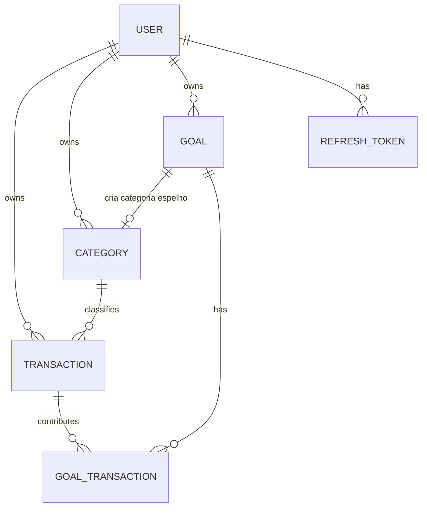
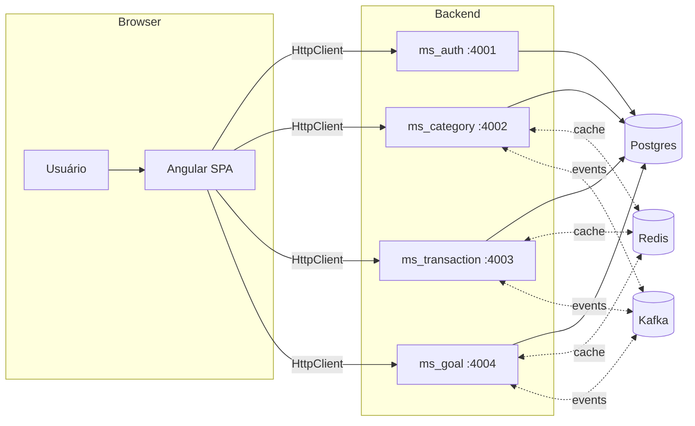
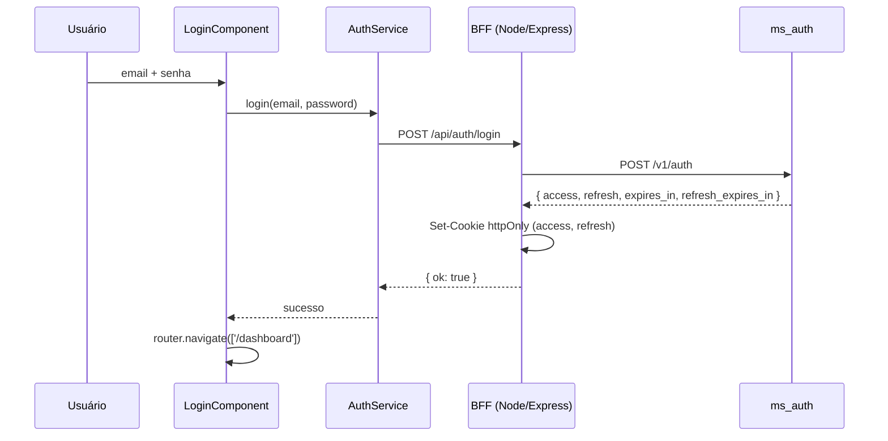
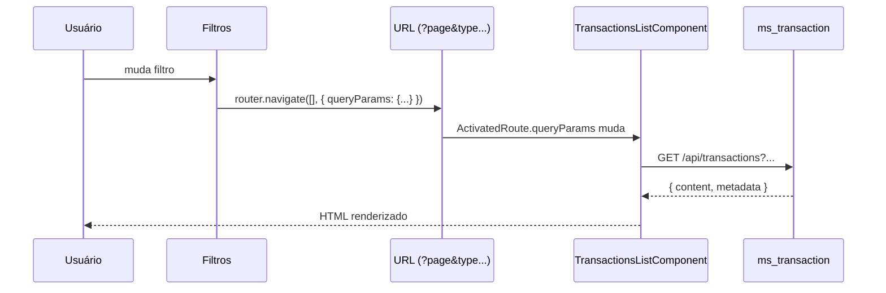
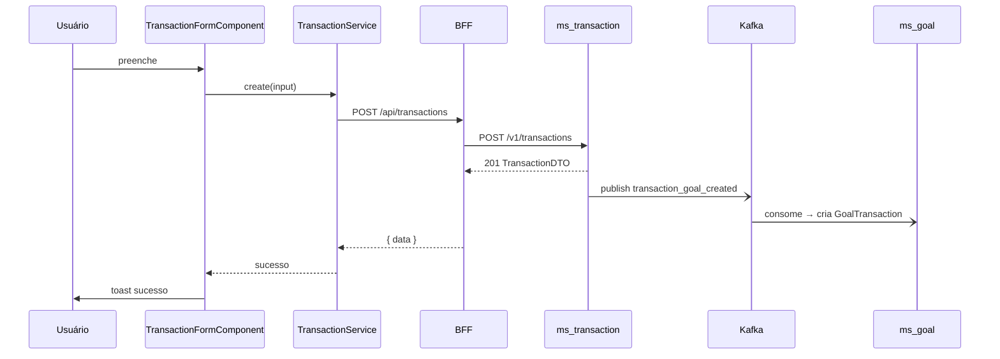
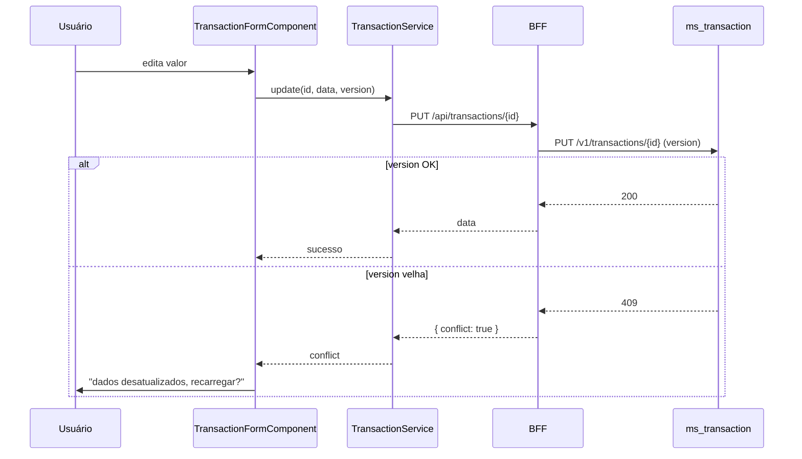

# `docs/api-guide-angular.md` — Guia de Integração Angular ↔ API Go

> **Projeto**: Minhas Finanças — API de finanças pessoais em microsserviços
> **Público-alvo**: time de frontend Angular (Standalone + Signals)
> **Versão do guia**: 2.0 (adaptado para Angular 22 — signal-first, zoneless, standalone)

---

## 1. Visão Geral do Sistema

### 1.1 Domínio

Aplicação de **gestão financeira pessoal**. O usuário registra transações (entradas/saídas), organiza em categorias, cria metas financeiras com progresso automático e consulta relatórios de balanço.

### 1.2 Entidades e relacionamentos



- `USER` — identidade e autenticação
- `CATEGORY` — classifica transações como `input` (entrada) ou `output` (saída). Pode estar vinculada a uma `GOAL`
- `TRANSACTION` — movimentação financeira com categoria obrigatória
- `GOAL` — meta com valor-alvo, deadline e status
- `GOAL_TRANSACTION` — vínculo N:N entre metas e transações (quando categoria tem `goal_id`)
- `REFRESH_TOKEN` — controle de sessão com family (rotação)

### 1.3 Fluxo de dados



---

## 2. Autenticação e Autorização

### 2.1 Fluxo completo

1. **Signup** → `POST /v1/users` (sem retornar token)
2. **Login** → `POST /v1/auth` retorna `{ access_token, refresh_token, expires_in, refresh_expires_in }`
3. **Requisições protegidas** → `Authorization: Bearer <access_token>`
4. **Expiração do access** → `POST /v1/auth/refresh` com `refresh_token` gera novo par
5. **Logout** → `POST /v1/auth/logout` revoga toda a família de refresh tokens

### 2.2 Onde o token viaja

| Token | Onde guardar no front | Por quê |
|---|---|---|
| `access_token` | **cookie httpOnly** (Set-Cookie) | Nunca no `localStorage` — XSS |
| `refresh_token` | **cookie httpOnly** (Set-Cookie) | Longa duração, alta sensibilidade |

**⚠️ Angular SPA puro não pode ler cookies httpOnly via JavaScript.** A única forma de usá-los é:

1. **BFF (Backend For Frontend)** — um servidor intermediário (Express, NestJS, etc.) que faz login, seta cookies httpOnly e injeta o `Authorization` nas chamadas ao backend Go. O Angular fala apenas com o BFF.
2. **SSR (Server-Side Rendering)** — o Angular Universal roda no servidor, lê cookies httpOnly da request e injeta nos headers das chamadas server-side. No client, o browser já envia os cookies automaticamente.

### 2.3 Recomendação para Angular

**Cenário A — SPA puro (sem SSR):**

- Criar um **BFF** (Node/Express, NestJS, ou até um proxy reverso) que:
  - Recebe `POST /api/auth/login` → chama `ms_auth` → seta cookies httpOnly → retorna `{ ok: true }`
  - Recebe `POST /api/auth/refresh` → lê cookie de refresh → chama `ms_auth` → atualiza cookies
  - Recebe `POST /api/auth/logout` → limpa cookies + revoga no backend
- O Angular usa um **HTTP Interceptor funcional** para:
  - Injetar `withCredentials: true` em todas as requisições (para enviar cookies httpOnly)
  - Tratar 401 → tentar refresh uma vez → se falhar, redirecionar para login

**Cenário B — SSR (Angular Universal):**

- Usar `HttpInterceptor` que lê cookies do `REQUEST` token (SSR) e os repassa nas chamadas
- No client, o browser envia cookies automaticamente com `withCredentials: true`
- Usar `provideClientHydration()` para hidratação sem flicker
- **⚠️** HttpOnly cookies **não são acessíveis via JavaScript no cliente** — o SSR é o único que pode lê-los diretamente do request

> **Por que httpOnly > localStorage?**
> `localStorage` é acessível por qualquer JS na página. Um XSS (dependência comprometida, `dangerouslySetInnerHTML`, etc.) consegue exfiltrar o token. Cookie httpOnly não é lido por JS — mitiga XSS. O custo: precisa de proteção CSRF (SameSite=Lax/Strict + token CSRF em mutações).

### 2.4 Refresh token rotation

O backend usa **refresh token family**: cada refresh gera novo refresh e marca o antigo como revogado. Se um refresh **já revogado** for usado novamente (indício de roubo), **toda a família é revogada** — usuário precisa logar de novo.

**Implicação pro front:**

- Faça refresh **serializado** (uma promise global / `shareReplay`) — refresh paralelos com o mesmo token disparam a revogação em cascata.
- Trate 401 no access → tente refresh **uma vez** → se falhar, redirecione pro login.

**Interceptor funcional recomendado:**

```ts
// src/app/core/interceptors/auth.interceptor.ts
import { HttpInterceptorFn, HttpErrorResponse } from '@angular/common/http';
import { inject } from '@angular/core';
import { catchError, switchMap, throwError } from 'rxjs';
import { AuthService } from '../services/auth.service';

export const authInterceptor: HttpInterceptorFn = (req, next) => {
  const auth = inject(AuthService);

  // Clona a request para incluir cookies
  const cloned = req.clone({ withCredentials: true });

  return next(cloned).pipe(
    catchError((err: HttpErrorResponse) => {
      if (err.status === 401 && !req.url.includes('/auth/refresh')) {
        return auth.refreshToken().pipe(
          switchMap(() => next(cloned)),
          catchError(() => {
            auth.logout();
            return throwError(() => err);
          })
        );
      }
      return throwError(() => err);
    })
  );
};
```

### 2.5 Autorização

- Rotas públicas: `/v1/auth/*`, `POST /v1/users`, `/health`, `/metrics`
- Todas as demais exigem `RequireActivatedUser` — **usuário com `activated=false` recebe 403** mesmo com token válido
- Não há roles — é single-user por token

---

## 3. Convenções da API

### 3.1 Base URL

Cada microserviço tem sua própria porta. **Não há API Gateway**.

```env
# environment.ts (dev)
export const environment = {
  production: false,
  apiUrl: 'http://localhost:3000/api', // BFF
  authUrl: 'http://localhost:4001',
  categoryUrl: 'http://localhost:4002',
  transactionUrl: 'http://localhost:4003',
  goalUrl: 'http://localhost:4004',
};
```

> **⚠️** Em produção, recomendo um **reverse proxy** (Nginx/Traefik) com prefixo por serviço (`/auth`, `/category`...) para o front consumir uma origem única. Isso simplifica CORS e cookies.

### 3.2 Envelope de resposta

**Listas** sempre embrulhadas:

```json
{
  "content": [ ... ],
  "metadata": {
    "current_page": 1,
    "page_size": 20,
    "first_page": 1,
    "last_page": 5,
    "total_records": 100
  }
}
```

**Shape confirmado** (`shared/utils/filters/filters.go`):

```go
type Metadata struct {
    CurrentPage  int `json:"current_page,omitempty"`
    PageSize     int `json:"page_size,omitempty"`
    FirstPage    int `json:"first_page,omitempty"`
    LastPage     int `json:"last_page,omitempty"`
    TotalRecords int `json:"total_records,omitempty"`
}
```

> **⚠️ GOTCHA — todos os campos têm `omitempty`**: quando **não há registros** (`totalRecords == 0`), o backend retorna `Metadata{}` — ou seja, **`metadata` vem como `{}` vazio**.
>
> Consequência pro front: **nunca assuma que `metadata.current_page` existe**. Trate `metadata` como `Partial<PaginationMetadata>` ou normalize no wrapper de fetch.
>
> ```ts
> const lastPage = metadata.last_page ?? 1;
> const total = metadata.total_records ?? 0;
> ```

**Item único**: objeto direto (sem envelope).

### 3.3 Paginação

| Param | Default | Limite | Descrição |
|---|---|---|---|
| `page` | `1` | `1` a `10.000.000` | Página atual |
| `page_size` | `20` | `1` a `100` | Itens por página |
| `sort` | `id` | — | Campo + direção (`-` = DESC). Safelist por recurso |
| `search` | `""` | — | Busca textual (nem todo endpoint tem) |

> **⚠️** Violações retornam 422 com `errors` contendo `{ page: "must be greater than zero" }` etc.

**Sorts suportados por recurso:**

| Recurso | Sorts permitidos |
|---|---|
| `users` | `id`, `name`, `-id`, `-name` |
| `categories` | `id`, `name`, `-id`, `-name` |
| `transactions` | `id`, `amount`, `-id`, `-amount` |
| `goals` | `id`, `name`, `-id`, `-name` |
| `goals_transactions` | `id`, `name`, `-id`, `-name` |

### 3.4 Formato de erros

O backend tem **dois formatos distintos** de erro.

#### 3.4.1 Erros gerais (HTTPError)

```json
{
  "path": "/v1/auth",
  "status": "Unauthorized",
  "message": "invalid authentication credentials"
}
```

| Campo | Tipo | Descrição |
|---|---|---|
| `path` | string | Path da requisição |
| `status` | string | **Texto** do status HTTP |
| `message` | string | Mensagem legível |

#### 3.4.2 Erros de validação (422 Unprocessable Entity)

```json
{
  "path": "/v1/users",
  "status": "Unprocessable Entity",
  "message": "validation failed",
  "errors": {
    "email": "must be a valid email address",
    "password": "must be at least 8 bytes long",
    "name": "must be at least 3 characters long"
  }
}
```

| Campo | Tipo | Descrição |
|---|---|---|
| `path` | string | Path da requisição |
| `status` | string | Sempre `"Unprocessable Entity"` |
| `message` | string | Sempre `"validation failed"` |
| `errors` | `Record<string, string>` | **Mapa campo → mensagem** |

> **⚠️ Validação NÃO é 400 — é 422.**

### 3.5 Códigos HTTP usados no backend

| Código | Quando | Corpo |
|---|---|---|
| `400` | JSON malformado / bad request genérico | HTTPError shape |
| `401` | Credenciais inválidas, token ausente/expirado | HTTPError shape |
| `403` | Conta inativa, sem permissão | HTTPError shape |
| `404` | Recurso não encontrado | HTTPError shape |
| `405` | Método não permitido | HTTPError shape |
| `409` | `ErrEditConflict` (versão desatualizada) | HTTPError shape |
| `422` | **Validação** ou **constraint de unicidade** | ValidationError shape |
| `429` | Rate limit | HTTPError shape |
| `500` | Erro interno | HTTPError shape |
| `504` | Timeout | HTTPError shape |

---

## 4. Catálogo de Endpoints

> **Legenda**: CS = Component + Service · GS = Guard Funcional · IS = Interceptor Funcional

### 4.1 `ms_auth` (porta 4001)

#### `POST /v1/auth` — Login

**Body:** `{ "email": "user@example.com", "password": "Senha123A" }`

**Response 200:**
```json
{
  "access_token": "eyJ...",
  "refresh_token": "eyJ...",
  "expires_in": 900,
  "refresh_expires_in": 2592000
}
```

**Erros:**
- `400` — JSON malformado
- `401` — `ErrInvalidCredentials`
- `403` — `ErrInactiveAccount`

**Snippet Angular — AuthService:**

```ts
// src/app/core/services/auth.service.ts
import { Injectable, signal, computed, inject } from '@angular/core';
import { HttpClient, HttpErrorResponse } from '@angular/common/http';
import { Router } from '@angular/router';
import { catchError, tap, throwError } from 'rxjs';

export interface TokenResponse {
  access_token: string;
  refresh_token: string;
  expires_in: number;
  refresh_expires_in: number;
}

@Injectable({ providedIn: 'root' })
export class AuthService {
  private http = inject(HttpClient);
  private router = inject(Router);

  private readonly _isAuthenticated = signal(false);
  readonly isAuthenticated = computed(() => this._isAuthenticated());

  login(email: string, password: string) {
    return this.http
      .post<TokenResponse>('/api/auth/login', { email, password })
      .pipe(
        tap(() => this._isAuthenticated.set(true)),
        catchError((err: HttpErrorResponse) => throwError(() => err))
      );
  }

  refreshToken() {
    return this.http.post<TokenResponse>('/api/auth/refresh', {});
  }

  logout() {
    this.http.post('/api/auth/logout', {}).subscribe({
      complete: () => {
        this._isAuthenticated.set(false);
        this.router.navigate(['/login']);
      },
    });
  }
}
```

**Snippet Angular — LoginComponent (Standalone + Signals):**

```ts
// src/app/features/auth/login/login.component.ts
import { Component, inject, signal } from '@angular/core';
import { FormsModule } from '@angular/forms';
import { Router } from '@angular/router';
import { AuthService } from '../../../core/services/auth.service';
import { HttpErrorResponse } from '@angular/common/http';

@Component({
  selector: 'app-login',
  standalone: true,
  imports: [FormsModule],
  template: `
    <div class="min-h-screen flex items-center justify-center bg-gradient-to-br from-slate-50 to-slate-100 p-4">
      <div class="w-full max-w-md">
        <div class="rounded-2xl border border-slate-200 bg-white p-8 shadow-xl">
          <div class="mb-8 text-center">
            <div class="mx-auto mb-4 flex h-14 w-14 items-center justify-center rounded-2xl bg-gradient-to-br from-emerald-400 to-teal-500 shadow-md">
              <span class="text-xl font-bold text-white">MF</span>
            </div>
            <h1 class="text-2xl font-bold tracking-tight text-slate-900">Minhas Finanças</h1>
            <p class="mt-1 text-sm text-slate-500">Entre para gerenciar suas finanças</p>
          </div>

          <form (ngSubmit)="onSubmit()" class="space-y-5">
            <div>
              <label for="email" class="mb-1.5 block text-sm font-medium text-slate-700">Email</label>
              <input
                id="email"
                type="email"
                [(ngModel)]="email"
                name="email"
                required
                autocomplete="email"
                placeholder="seu@email.com"
                class="w-full rounded-lg border border-slate-300 bg-white px-3 py-2.5 text-slate-900 placeholder:text-slate-400 transition-all duration-150 focus:outline-none focus:border-emerald-500 focus:ring-2 focus:ring-emerald-500/20 disabled:opacity-60 disabled:cursor-not-allowed"
              />
              @if (fieldErrors()['email']) {
                <p class="mt-1.5 flex items-center gap-1 text-xs text-red-600">
                  <span aria-hidden>⚠</span> {{ fieldErrors()['email'] }}
                </p>
              }
            </div>

            <div>
              <div class="mb-1.5 flex items-center justify-between">
                <label for="password" class="block text-sm font-medium text-slate-700">Senha</label>
                <a href="#" class="text-xs text-emerald-600 hover:text-emerald-700 hover:underline">Esqueceu?</a>
              </div>
              <input
                id="password"
                type="password"
                [(ngModel)]="password"
                name="password"
                required
                autocomplete="current-password"
                placeholder="••••••••"
                class="w-full rounded-lg border border-slate-300 bg-white px-3 py-2.5 text-slate-900 placeholder:text-slate-400 transition-all duration-150 focus:outline-none focus:border-emerald-500 focus:ring-2 focus:ring-emerald-500/20 disabled:opacity-60 disabled:cursor-not-allowed"
              />
              @if (fieldErrors()['password']) {
                <p class="mt-1.5 flex items-center gap-1 text-xs text-red-600">
                  <span aria-hidden>⚠</span> {{ fieldErrors()['password'] }}
                </p>
              }
            </div>

            @if (error()) {
              <div role="alert" class="flex items-start gap-2 rounded-lg border border-red-200 bg-red-50 px-3 py-2.5 text-sm text-red-700">
                <span aria-hidden class="shrink-0">⚠</span>
                <span>{{ error() }}</span>
              </div>
            }

            <button
              type="submit"
              [disabled]="isPending()"
              class="w-full rounded-lg bg-emerald-600 px-4 py-2.5 font-medium text-white shadow-sm transition-all duration-150 hover:bg-emerald-700 focus:outline-none focus:ring-2 focus:ring-emerald-500 focus:ring-offset-2 active:scale-[0.98] disabled:opacity-60 disabled:cursor-not-allowed disabled:active:scale-100"
            >
              {{ isPending() ? 'Entrando…' : 'Entrar' }}
            </button>
          </form>
        </div>
        <p class="mt-6 text-center text-xs text-slate-400">
          Não tem conta? <a routerLink="/signup" class="font-medium text-emerald-600 hover:text-emerald-700 hover:underline">Cadastre-se</a>
        </p>
      </div>
    </div>
  `,
})
export class LoginComponent {
  private auth = inject(AuthService);
  private router = inject(Router);

  email = '';
  password = '';
  isPending = signal(false);
  error = signal<string | null>(null);
  fieldErrors = signal<Record<string, string>>({});

  onSubmit() {
    this.isPending.set(true);
    this.error.set(null);
    this.fieldErrors.set({});

    this.auth.login(this.email, this.password).subscribe({
      next: () => this.router.navigate(['/dashboard']),
      error: (err: HttpErrorResponse) => {
        this.isPending.set(false);
        if (err.status === 422 && err.error?.errors) {
          this.fieldErrors.set(err.error.errors);
          this.error.set(err.error.message ?? 'Erro de validação');
        } else {
          this.error.set(err.error?.message ?? 'Falha no login');
        }
      },
      complete: () => this.isPending.set(false),
    });
  }
}
```

#### `POST /v1/auth/refresh` — Renovar tokens

**Body:** `{ "refresh_token": "eyJ..." }`
**Response 200:** igual ao login.

**Erros:**
- `400` — JSON malformado
- `400` — refresh token revogado
- `400` — refresh token expirado
- `401` — token inválido

#### `POST /v1/auth/logout` — Logout

**Body:** `{ "refresh_token": "eyJ..." }`
**Response 204**.

#### `POST /v1/users` — Cadastro

**Body:** `{ "email": "user@example.com", "password": "Senha123A", "name": "João" }`

**Response 201:**
```json
{ "id": "uuid", "email": "...", "name": "...", "version": 1 }
```

**Erros:**
- `400` — JSON malformado
- `422` — validação (senha ≥8 chars, com letra e número; nome 3–100 chars; email válido)
- `422` — email duplicado

---

### 4.2 `ms_category` (porta 4002)

#### `POST /v1/categories` — Criar categoria

**Body:**
```json
{ "name": "Salário", "type": "input", "goal_id": "uuid" }
```

**Response 201:**
```json
{ "id": "uuid", "user_id": "uuid", "name": "Salário", "type": "input", "goal_id": null }
```

**Erros:**
- `400` — JSON malformado
- `403` — sem permissão (conta inativa)
- `422` — validação (name 3–100 chars, type ∈ {input, output}, user_id obrigatório)
- `422` — nome duplicado

#### `GET /v1/categories` — Listar

**Query:** `page`, `page_size`, `sort` (`id|name|-id|-name`), `search`.
**Response 200:** `{ content: CategoryDTO[], metadata: {...} }`.

**Snippet Angular — CategoriesListComponent:**

```ts
// src/app/features/categories/categories-list/categories-list.component.ts
import { Component, inject, signal, computed, OnInit } from '@angular/core';
import { CommonModule } from '@angular/common';
import { RouterLink } from '@angular/router';
import { HttpClient, HttpErrorResponse } from '@angular/common/http';
import { Paginated, Category, PaginationMetadata } from '../../../core/models/api.types';
import { PaginationComponent } from '../../../shared/pagination/pagination.component';

@Component({
  selector: 'app-categories-list',
  standalone: true,
  imports: [CommonModule, RouterLink, PaginationComponent],
  template: `
    <div class="mx-auto max-w-5xl space-y-6 p-6">
      <header class="flex items-center justify-between">
        <div>
          <h1 class="text-2xl font-bold tracking-tight text-slate-900">Categorias</h1>
          <p class="mt-1 text-sm text-slate-500">{{ total() }} categorias cadastradas</p>
        </div>
        <a routerLink="/categories/new" class="rounded-lg bg-emerald-600 px-4 py-2 font-medium text-white shadow-sm transition-colors hover:bg-emerald-700">
          + Nova categoria
        </a>
      </header>

      @if (loading()) {
        <div class="rounded-2xl border border-dashed border-slate-300 bg-white p-12 text-center">
          <p class="text-sm text-slate-500">Carregando…</p>
        </div>
      } @else if (categories().length === 0) {
        <div class="rounded-2xl border border-dashed border-slate-300 bg-white p-12 text-center">
          <p class="text-sm text-slate-500">Nenhuma categoria cadastrada.</p>
        </div>
      } @else {
        <ul class="divide-y divide-slate-200 overflow-hidden rounded-2xl border border-slate-200 bg-white shadow-sm">
          @for (c of categories(); track c.id) {
            <li class="flex items-center justify-between px-5 py-4 transition-colors hover:bg-slate-50">
              <div class="flex items-center gap-3">
                <span class="inline-flex h-9 w-9 items-center justify-center rounded-full text-sm font-semibold"
                  [class]="c.type === 'input' ? 'bg-emerald-100 text-emerald-700' : 'bg-rose-100 text-rose-700'"
                  aria-hidden>
                  {{ c.type === 'input' ? '↑' : '↓' }}
                </span>
                <div>
                  <p class="font-medium text-slate-900">{{ c.name }}</p>
                  <p class="text-xs text-slate-500">
                    {{ c.type === 'input' ? 'Entrada' : 'Saída' }}
                    @if (c.goal_id) { • vinculada a meta }
                  </p>
                </div>
              </div>
              <a [routerLink]="['/categories', c.id]" class="text-sm font-medium text-emerald-600 hover:text-emerald-700 hover:underline">
                Editar
              </a>
            </li>
          }
        </ul>
      }

      <app-pagination [meta]="metadata()" />
    </div>
  `,
})
export class CategoriesListComponent implements OnInit {
  private http = inject(HttpClient);

  categories = signal<Category[]>([]);
  metadata = signal<Partial<PaginationMetadata>>({});
  loading = signal(true);

  total = computed(() => this.metadata().total_records ?? 0);

  ngOnInit() {
    this.http.get<Paginated<Category>>('/api/categories').subscribe({
      next: (res) => {
        this.categories.set(res.content);
        this.metadata.set(res.metadata);
        this.loading.set(false);
      },
      error: () => this.loading.set(false),
    });
  }
}
```

#### `GET /v1/categories/{id}` — Detalhe

**Response 200:** `CategoryDTO`.
**Erros:** `404`.

#### `PUT /v1/categories/{id}` — Atualizar

**Body:** `CategoryDTO` (parcial).
**Response 200:** `CategoryDTO`.
**Erros:** `404`, `422`.

#### `DELETE /v1/categories/{id}` — Remover

**Response 204**.

**Erros:**
- `400` — se a categoria tiver `goal_id`
- `404`

**Side effects:** dispara evento Kafka `category_deleted` → ms_transaction apaga transações vinculadas.

---

### 4.3 `ms_transaction` (porta 4003)

#### `POST /v1/transactions` — Criar transação

**Body:**
```json
{ "amount": 150.50, "category_id": "uuid", "description": "Almoço" }
```

**Response 201:**
```json
{
  "id": "uuid",
  "amount": 150.50,
  "category_id": "uuid",
  "description": "Almoço",
  "version": 1,
  "created_at": "2026-09-17T12:00:00Z"
}
```

**Erros:**
- `400` — JSON malformado
- `422` — validação (amount > 0, category_id obrigatório, description ≤ 100 chars)
- `422` — categoria já usada
- `404` — categoria não existe

#### `GET /v1/transactions` — Listar com filtros

**Query params:**

| Param | Tipo | Descrição |
|---|---|---|
| `page` | int | default 1 |
| `page_size` | int | default 20 (máx 100) |
| `sort` | string | `id \| amount \| -id \| -amount` |
| `start_date` | date | filtro `created_at >=` |
| `end_date` | date | filtro `created_at <=` |
| `category_id` | uuid | filtro |
| `type` | `input\|output` | filtro |

**Response 200:** envelope com `TransactionDTO[]`.

**Snippet Angular — TransactionsListComponent (filtros via URL):**

```ts
// src/app/features/transactions/transactions-list/transactions-list.component.ts
import { Component, inject, signal, computed, OnInit } from '@angular/core';
import { CommonModule } from '@angular/common';
import { RouterLink, ActivatedRoute, Router } from '@angular/router';
import { HttpClient, HttpParams, HttpErrorResponse } from '@angular/common/http';
import { Paginated, Transaction, Category, PaginationMetadata, TransactionFilters } from '../../../core/models/api.types';
import { PaginationComponent } from '../../../shared/pagination/pagination.component';

@Component({
  selector: 'app-transactions-list',
  standalone: true,
  imports: [CommonModule, RouterLink, PaginationComponent],
  template: `
    <div class="mx-auto max-w-6xl space-y-6 p-6">
      <header class="flex flex-wrap items-center justify-between gap-4">
        <div>
          <h1 class="text-2xl font-bold tracking-tight text-slate-900">Transações</h1>
          <p class="mt-1 text-sm text-slate-500">{{ total() }} registros</p>
        </div>
        <a routerLink="/transactions/new" class="rounded-lg bg-emerald-600 px-4 py-2 font-medium text-white shadow-sm transition-colors hover:bg-emerald-700">
          + Nova transação
        </a>
      </header>

      <!-- Filtros -->
      <div class="rounded-2xl border border-slate-200 bg-white p-4 shadow-sm">
        <div class="grid gap-3 md:grid-cols-4">
          <div>
            <label class="mb-1 block text-xs font-medium uppercase tracking-wide text-slate-500">Tipo</label>
            <select [value]="filters().type ?? ''" (change)="onFilterChange('type', $event)"
              class="w-full rounded-lg border border-slate-300 bg-white px-3 py-2 text-sm text-slate-900">
              <option value="">Todos</option>
              <option value="input">Entradas</option>
              <option value="output">Saídas</option>
            </select>
          </div>
          <!-- outros filtros... -->
        </div>
      </div>

      @if (transactions().length === 0) {
        <div class="rounded-2xl border border-dashed border-slate-300 bg-white p-12 text-center">
          <p class="text-sm text-slate-500">Nenhuma transação encontrada.</p>
        </div>
      } @else {
        <div class="overflow-hidden rounded-2xl border border-slate-200 bg-white shadow-sm">
          <table class="w-full">
            <thead class="bg-slate-50 text-left text-xs font-semibold uppercase tracking-wide text-slate-500">
              <tr>
                <th class="px-5 py-3">Descrição</th>
                <th class="px-5 py-3">Categoria</th>
                <th class="px-5 py-3 text-right">Valor</th>
                <th class="px-5 py-3">Data</th>
                <th class="px-5 py-3"></th>
              </tr>
            </thead>
            <tbody class="divide-y divide-slate-100">
              @for (t of transactions(); track t.id) {
                <tr class="transition-colors hover:bg-slate-50">
                  <td class="px-5 py-4 font-medium text-slate-900">{{ t.description }}</td>
                  <td class="px-5 py-4 text-sm text-slate-600">{{ getCategoryName(t.category_id) }}</td>
                  <td class="px-5 py-4 text-right font-semibold"
                    [class]="isInput(t.category_id) ? 'text-emerald-600' : 'text-rose-600'">
                    {{ t.amount | currency:'BRL' }}
                  </td>
                  <td class="px-5 py-4 text-sm text-slate-500">{{ t.created_at | date:'dd/MM/yyyy' }}</td>
                  <td class="px-5 py-4 text-right">
                    <a [routerLink]="['/transactions', t.id]" class="text-sm font-medium text-emerald-600 hover:text-emerald-700 hover:underline">
                      Editar
                    </a>
                  </td>
                </tr>
              }
            </tbody>
          </table>
        </div>
      }

      <app-pagination [meta]="metadata()" />
    </div>
  `,
})
export class TransactionsListComponent implements OnInit {
  private http = inject(HttpClient);
  private route = inject(ActivatedRoute);
  private router = inject(Router);

  transactions = signal<Transaction[]>([]);
  categories = signal<Category[]>([]);
  metadata = signal<Partial<PaginationMetadata>>({});
  filters = signal<TransactionFilters>({});
  loading = signal(true);

  total = computed(() => this.metadata().total_records ?? 0);

  ngOnInit() {
    this.route.queryParams.subscribe((params) => {
      this.filters.set({
        page: Number(params['page']) || 1,
        page_size: Number(params['page_size']) || 20,
        sort: params['sort'] || '-id',
        type: params['type'] || undefined,
        start_date: params['start_date'] || undefined,
        end_date: params['end_date'] || undefined,
        category_id: params['category_id'] || undefined,
      });
      this.loadData();
    });
  }

  private loadData() {
    this.loading.set(true);
    const f = this.filters();
    let params = new HttpParams();
    if (f.page) params = params.set('page', f.page);
    if (f.page_size) params = params.set('page_size', f.page_size);
    if (f.sort) params = params.set('sort', f.sort);
    if (f.type) params = params.set('type', f.type);
    if (f.start_date) params = params.set('start_date', f.start_date);
    if (f.end_date) params = params.set('end_date', f.end_date);
    if (f.category_id) params = params.set('category_id', f.category_id);

    this.http.get<Paginated<Transaction>>('/api/transactions', { params }).subscribe({
      next: (res) => {
        this.transactions.set(res.content);
        this.metadata.set(res.metadata);
        this.loading.set(false);
      },
      error: () => this.loading.set(false),
    });
  }

  onFilterChange(key: string, event: Event) {
    const value = (event.target as HTMLSelectElement).value;
    this.router.navigate([], {
      relativeTo: this.route,
      queryParams: { [key]: value || null, page: 1 },
      queryParamsHandling: 'merge',
    });
  }

  getCategoryName(id: string): string {
    return this.categories().find((c) => c.id === id)?.name ?? '—';
  }

  isInput(id: string): boolean {
    return this.categories().find((c) => c.id === id)?.type === 'input';
  }
}
```

#### `GET /v1/transactions/{id}` — Detalhe

**Response 200:** `TransactionDTO`.
**Erros:** `404`.

#### `GET /v1/transactions/summary` — Resumo financeiro

**Query:** `start_date`, `end_date`, `category_id`, `type`.

**Response 200:**
```json
{
  "period": { "start_date": "2026-01-01", "end_date": "2026-09-17" },
  "total": 5000.00,
  "total_input": 6000.00,
  "total_output": 1000.00,
  "balance": 5000.00,
  "count": 42,
  "by_category": [
    { "category_id": "uuid", "category_name": "Salário", "type": "input", "total": 6000, "count": 1 },
    { "category_id": "uuid", "category_name": "Mercado", "type": "output", "total": 1000, "count": 41 }
  ]
}
```

**Snippet Angular — DashboardComponent:**

```ts
// src/app/features/dashboard/dashboard.component.ts
import { Component, inject, signal, computed, OnInit } from '@angular/core';
import { CommonModule } from '@angular/common';
import { HttpClient } from '@angular/common/http';
import { Summary } from '../../core/models/api.types';

@Component({
  selector: 'app-dashboard',
  standalone: true,
  imports: [CommonModule],
  template: `
    <div class="mx-auto max-w-6xl space-y-6 p-6">
      <header>
        <h1 class="text-2xl font-bold tracking-tight text-slate-900">Dashboard</h1>
        <p class="mt-1 text-sm text-slate-500">Visão geral das suas finanças</p>
      </header>

      @if (summary(); as s) {
        <div class="grid gap-4 sm:grid-cols-2 lg:grid-cols-4">
          <app-summary-card label="Saldo" [value]="s.balance" tone="neutral" />
          <app-summary-card label="Entradas" [value]="s.total_input" tone="positive" />
          <app-summary-card label="Saídas" [value]="s.total_output" tone="negative" />
          <app-summary-card label="Transações" [value]="s.count" [isCount]="true" />
        </div>

        <section class="rounded-2xl border border-slate-200 bg-white p-6 shadow-sm">
          <h2 class="mb-4 text-lg font-semibold text-slate-900">Por categoria</h2>
          <ul class="divide-y divide-slate-100">
            @for (item of s.by_category; track item.category_id) {
              <li class="flex items-center justify-between py-3">
                <div class="flex items-center gap-3">
                  <span class="inline-flex h-9 w-9 items-center justify-center rounded-full text-sm font-semibold"
                    [class]="item.type === 'input' ? 'bg-emerald-100 text-emerald-700' : 'bg-rose-100 text-rose-700'"
                    aria-hidden>
                    {{ item.type === 'input' ? '↑' : '↓' }}
                  </span>
                  <div>
                    <p class="font-medium text-slate-900">{{ item.category_name }}</p>
                    <p class="text-xs text-slate-500">{{ item.count }} transações</p>
                  </div>
                </div>
                <span class="font-semibold" [class]="item.type === 'input' ? 'text-emerald-600' : 'text-rose-600'">
                  {{ item.total | currency:'BRL' }}
                </span>
              </li>
            }
          </ul>
        </section>
      } @else {
        <div class="rounded-2xl border border-dashed border-slate-300 bg-white p-12 text-center">
          <p class="text-sm text-slate-500">Carregando resumo…</p>
        </div>
      }
    </div>
  `,
})
export class DashboardComponent implements OnInit {
  private http = inject(HttpClient);
  summary = signal<Summary | null>(null);

  ngOnInit() {
    this.http.get<Summary>('/api/transactions/summary').subscribe({
      next: (res) => this.summary.set(res),
    });
  }
}
```

#### `PUT /v1/transactions/{id}` — Atualizar

**Body:** `TransactionDTO` **incluindo `version`**.
**Response 200:** `TransactionDTO` atualizado.

**Erros:**
- `400` — JSON malformado
- `404`
- `409 ErrEditConflict` — versão desatualizada
- `422` — validação / constraint

#### `DELETE /v1/transactions/{id}` — Deletar

**Response 204**. **Erros**: `404`.

---

### 4.4 `ms_goal` (porta 4004)

#### `POST /v1/goals` — Criar meta

**Body:**
```json
{
  "name": "Viagem",
  "target_amount": 5000,
  "deadline": "2026-12-31T00:00:00Z",
  "description": "Europa"
}
```

**Response 201:**
```json
{
  "id": "uuid",
  "user_id": "uuid",
  "name": "Viagem",
  "target_amount": 5000,
  "current_amount": 0,
  "status": "IN_PROGRESS",
  "deadline": "2026-12-31T00:00:00Z",
  "created_at": "2026-09-17T12:00:00Z"
}
```

**Side effect:** publica evento Kafka `goal_created` → ms_category cria automaticamente uma categoria espelho vinculada à meta.

**Erros:**
- `400` — JSON malformado
- `422` — validação

#### `GET /v1/goals` — Listar

**Query:** `page`, `page_size`, `sort` (`id|name|-id|-name`), `status` (PT-BR).

**Response 200:** `{ content: GoalDTO[], metadata }`.

> **⚠️ GOTCHA CRÍTICO**: você envia filtro em **PT-BR** (`"em andamento"`, `"concluído"`, `"vencido"`, `"cancelado"`), mas recebe `status` em **EN** (`IN_PROGRESS/COMPLETED/...`).

**Snippet Angular — GoalsListComponent:**

```ts
// src/app/features/goals/goals-list/goals-list.component.ts
import { Component, inject, signal, OnInit } from '@angular/core';
import { CommonModule } from '@angular/common';
import { RouterLink } from '@angular/router';
import { HttpClient } from '@angular/common/http';
import { Goal } from '../../../core/models/api.types';

const STATUS_MAP: Record<string, { label: string; cls: string }> = {
  IN_PROGRESS: { label: 'Em andamento', cls: 'bg-sky-100 text-sky-700' },
  COMPLETED: { label: 'Concluída', cls: 'bg-emerald-100 text-emerald-700' },
  EXPIRED: { label: 'Vencida', cls: 'bg-amber-100 text-amber-700' },
  CANCELED: { label: 'Cancelada', cls: 'bg-slate-100 text-slate-600' },
};

const STATUS_TO_PT: Record<string, string> = {
  IN_PROGRESS: 'em andamento',
  COMPLETED: 'concluído',
  EXPIRED: 'vencido',
  CANCELED: 'cancelado',
};

@Component({
  selector: 'app-goals-list',
  standalone: true,
  imports: [CommonModule, RouterLink],
  template: `
    <div class="mx-auto max-w-6xl space-y-6 p-6">
      <header class="flex items-center justify-between">
        <div>
          <h1 class="text-2xl font-bold tracking-tight text-slate-900">Metas</h1>
          <p class="mt-1 text-sm text-slate-500">Acompanhe o progresso dos seus objetivos</p>
        </div>
        <a routerLink="/goals/new" class="rounded-lg bg-emerald-600 px-4 py-2 font-medium text-white shadow-sm transition-colors hover:bg-emerald-700">
          + Nova meta
        </a>
      </header>

      @if (goals().length === 0) {
        <div class="rounded-2xl border border-dashed border-slate-300 bg-white p-12 text-center">
          <p class="text-sm text-slate-500">Nenhuma meta cadastrada.</p>
        </div>
      } @else {
        <ul class="grid gap-4 md:grid-cols-2">
          @for (g of goals(); track g.id) {
            <li>
              <a [routerLink]="['/goals', g.id]"
                class="block rounded-2xl border border-slate-200 bg-white p-5 shadow-sm transition-all hover:border-emerald-300 hover:shadow-md">
                <div class="flex items-start justify-between gap-3">
                  <h3 class="font-semibold text-slate-900">{{ g.name }}</h3>
                  <span class="shrink-0 rounded-full px-2.5 py-0.5 text-xs font-medium"
                    [class]="getStatusMeta(g.status).cls">
                    {{ getStatusMeta(g.status).label }}
                  </span>
                </div>
                <p class="mt-1 text-xs text-slate-500">Prazo: {{ g.deadline | date:'dd/MM/yyyy' }}</p>
                <div class="mt-4">
                  <div class="flex items-baseline justify-between text-sm">
                    <span class="font-semibold text-slate-900">{{ g.current_amount | currency:'BRL' }}</span>
                    <span class="text-xs text-slate-500">de {{ g.target_amount | currency:'BRL' }}</span>
                  </div>
                  <div class="mt-2 h-2 w-full overflow-hidden rounded-full bg-slate-100">
                    <div class="h-full rounded-full bg-gradient-to-r from-emerald-400 to-teal-500 transition-all"
                      [style.width.%]="getProgress(g)"></div>
                  </div>
                  <p class="mt-1.5 text-right text-xs font-medium text-emerald-600">
                    {{ getProgress(g).toFixed(1) }}%
                  </p>
                </div>
              </a>
            </li>
          }
        </ul>
      }
    </div>
  `,
})
export class GoalsListComponent implements OnInit {
  private http = inject(HttpClient);
  goals = signal<Goal[]>([]);

  ngOnInit() {
    this.http.get<{ content: Goal[] }>('/api/goals').subscribe({
      next: (res) => this.goals.set(res.content),
    });
  }

  getStatusMeta(status: string) {
    return STATUS_MAP[status] ?? { label: status, cls: '' };
  }

  getProgress(g: Goal): number {
    return Math.min(100, (g.current_amount / g.target_amount) * 100);
  }
}
```

#### `GET /v1/goals/{id}` — Detalhe

**Response 200:** `GoalDTO`.

#### `GET /v1/goals/report/{id}` — Relatório da meta

**Response 200:**
```json
{
  "goal": { ... },
  "total_contributed": 301.5,
  "progress": 0.012,
  "value_per_month": 277464.34,
  "remaining_amount": 2499698,
  "transactions_count": 2,
  "last_contribution": "2026-09-11T13:00:44.629869Z"
}
```

| Campo | Tipo | Descrição |
|---|---|---|
| `goal` | `GoalDTO` | meta completa |
| `total_contributed` | number | soma dos valores das transações vinculadas |
| `progress` | number | **fração** de 0 a 100 (não 0 a 1). Ex: `0.012` = 0.012% |
| `value_per_month` | number | valor sugerido por mês para bater a meta |
| `remaining_amount` | number | quanto falta |
| `transactions_count` | number | quantas transações contribuem |
| `last_contribution` | string \| null | ISO 8601 da última contribuição |

> **⚠️ Atenção ao `progress`**: o valor retornado é a **fração/percentual em escala 0–100** (ex: `0.012` = 0.012%), não em escala 0–1.

**Snippet Angular — GoalReportComponent (com `@defer`):**

```ts
// src/app/features/goals/goal-detail/goal-detail.component.ts
import { Component, inject, signal, input } from '@angular/core';
import { CommonModule } from '@angular/common';
import { HttpClient } from '@angular/common/http';
import { GoalReport } from '../../../core/models/api.types';

@Component({
  selector: 'app-goal-detail',
  standalone: true,
  imports: [CommonModule],
  template: `
    <div class="mx-auto max-w-4xl space-y-6 p-6">
      @if (report(); as r) {
        <header class="flex items-start justify-between gap-4">
          <div>
            <h1 class="text-2xl font-bold tracking-tight text-slate-900">{{ r.goal.name }}</h1>
            @if (r.goal.description) {
              <p class="mt-1 text-sm text-slate-500">{{ r.goal.description }}</p>
            }
          </div>
          <span class="rounded-full bg-sky-100 px-3 py-1 text-xs font-medium text-sky-700">
            {{ r.goal.status }}
          </span>
        </header>

        <section class="rounded-2xl border border-slate-200 bg-white p-6 shadow-sm">
          <div class="flex items-baseline justify-between">
            <div>
              <p class="text-xs font-medium uppercase tracking-wide text-slate-500">Contribuído</p>
              <p class="mt-1 text-3xl font-bold tracking-tight text-slate-900">
                {{ r.total_contributed | currency:'BRL' }}
              </p>
            </div>
            <p class="text-sm text-slate-500">
              de <span class="font-semibold text-slate-700">{{ r.goal.target_amount | currency:'BRL' }}</span>
            </p>
          </div>
          <div class="mt-4 h-3 w-full overflow-hidden rounded-full bg-slate-100">
            <div class="h-full rounded-full bg-gradient-to-r from-emerald-400 to-teal-500 transition-all"
              [style.width.%]="Math.min(100, r.progress)"></div>
          </div>
          <p class="mt-2 text-right text-sm font-medium text-emerald-600">
            {{ r.progress.toFixed(2) }}%
          </p>
        </section>

        <div class="grid gap-4 sm:grid-cols-3">
          <app-metric-card label="Falta" [value]="r.remaining_amount | currency:'BRL'" />
          <app-metric-card label="Sugerido / mês" [value]="r.value_per_month | currency:'BRL'" />
          <app-metric-card label="Transações" [value]="r.transactions_count.toString()" />
        </div>
      } @else {
        <app-report-skeleton />
      }
    </div>
  `,
})
export class GoalDetailComponent {
  private http = inject(HttpClient);
  report = signal<GoalReport | null>(null);

  ngOnInit() {
    // Usar `input()` para ler o parâmetro de rota
    const id = '...'; // via ActivatedRoute
    this.http.get<GoalReport>(`/api/goals/report/${id}`).subscribe({
      next: (res) => this.report.set(res),
    });
  }

  protected Math = Math;
}
```

#### `PUT /v1/goals/{id}` — Atualizar

**Body:** `GoalDTO` (parcial).
**Response 200:** `GoalDTO`.
**Erros:** `404`, `422`.

#### `DELETE /v1/goals/{id}` — Deletar

**Response 204**.

**Side effect:** publica `goal_deleted` → ms_category remove categoria espelho; ms_goal apaga goal_transactions.

---

### 4.5 `ms_goal` — `goals_transactions` (porta 4004)

Vínculo entre metas e transações. **Front provavelmente não chama direto** — fluxo é: usuário cria transação em categoria com `goal_id` → ms_transaction publica evento → ms_goal cria o vínculo.

#### `POST /v1/goals_transactions` — Criar vínculo
**Body:** `{ "goal_id": "uuid", "transaction_id": "uuid", "amount": 100.0 }`
**Response 201**. **Erros**: `422`.

#### `GET /v1/goals_transactions?goal_id=uuid` — Listar vínculos de uma meta
**Response 200:** envelope.

#### `GET /v1/goals_transactions/{id}` — Detalhe
#### `PUT /v1/goals_transactions/{id}` — Atualizar
#### `DELETE /v1/goals_transactions/{id}` — Deletar

> **⚠️ Esses endpoints são administrativos** — o front só precisa deles se quiser mostrar detalhes de contribuições. **Candidato a ignorar no MVP**.

---

## 5. Tipos TypeScript — `src/app/core/models/api.types.ts`

Conversões aplicadas:
- `json:"x,omitempty"` → `x?: T`
- `*T` → `T | null` (quando o campo é ponteiro Go)
- `int64` → `number` (⚠️ se ultrapassar 2⁵³ use `bigint` — não é o caso aqui)
- `time.Time` → `string` (ISO 8601)
- Constantes Go → union types

```ts
// src/app/core/models/api.types.ts

/* ============ Envelope ============ */
export interface Paginated<T> {
  content: T[];
  /** ⚠️ Vem como {} quando totalRecords === 0 (todos os campos têm omitempty) */
  metadata: Partial<PaginationMetadata>;
}

export interface PaginationMetadata {
  current_page: number;
  page_size: number;
  first_page: number;
  last_page: number;
  total_records: number;
}

/* ============ Erros ============ */
export interface HttpErrorResponse {
  path: string;
  status: string;
  message: string;
}

export interface ValidationErrorResponse {
  path: string;
  status: 'Unprocessable Entity';
  message: 'validation failed';
  errors: Record<string, string>;
}

export type ApiErrorResponse = HttpErrorResponse | ValidationErrorResponse;

/* ============ Auth ============ */
export interface LoginInput {
  email: string;
  password: string;
}

export interface TokenResponse {
  access_token: string;
  refresh_token: string;
  expires_in: number;
  refresh_expires_in: number;
}

export interface RefreshInput {
  refresh_token: string;
}

/* ============ User ============ */
export interface SignUpInput {
  email: string;
  password: string;
  name: string;
}

export interface User {
  id: string;
  email: string;
  name: string;
  version: number;
}

/* ============ Category ============ */
export type CategoryType = 'input' | 'output';

export interface Category {
  id?: string | null;
  user_id?: string | null;
  name?: string | null;
  type: CategoryType | null;
  goal_id?: string | null;
}

export interface CreateCategoryInput {
  name: string;
  type: CategoryType;
  goal_id?: string | null;
}

/* ============ Goal ============ */
export type GoalStatus = 'IN_PROGRESS' | 'COMPLETED' | 'EXPIRED' | 'CANCELED';

export type GoalStatusFilter =
  | 'em andamento'
  | 'concluído'
  | 'vencido'
  | 'cancelado';

export interface Goal {
  id: string;
  user_id: string;
  name: string;
  target_amount: number;
  current_amount: number;
  status: GoalStatus;
  deadline: string;
  description?: string | null;
  created_at: string;
}

export interface CreateGoalInput {
  name: string;
  target_amount: number;
  deadline: string;
  description?: string;
}

export interface GoalReport {
  goal: Goal;
  total_contributed: number;
  /** ⚠️ 0 a 100 (não 0 a 1). Ex: 0.012 = 0.012% */
  progress: number;
  value_per_month: number;
  remaining_amount: number;
  transactions_count: number;
  last_contribution?: string | null;
}

/* ============ GoalTransaction ============ */
export interface GoalTransaction {
  id?: string;
  goal_id?: string;
  transaction_id?: string;
  amount?: number;
  created_at?: string;
}

export interface CreateGoalTransactionInput {
  goal_id: string;
  transaction_id: string;
  amount: number;
}

/* ============ Transaction ============ */
export interface Transaction {
  id: string;
  amount: number;
  category_id: string;
  description: string;
  version: number;
  created_at: string;
}

export interface CreateTransactionInput {
  amount: number;
  category_id: string;
  description: string;
}

export interface UpdateTransactionInput extends CreateTransactionInput {
  version: number;
}

export interface TransactionFilters {
  page?: number;
  page_size?: number;
  sort?: 'id' | 'amount' | '-id' | '-amount';
  start_date?: string;
  end_date?: string;
  category_id?: string;
  type?: CategoryType;
}

/* ============ Summary ============ */
export interface Summary {
  period: { start_date?: string | null; end_date?: string | null };
  total: number;
  total_input: number;
  total_output: number;
  balance: number;
  count: number;
  by_category: SummaryItem[];
}

export interface SummaryItem {
  category_id: string;
  category_name: string;
  type: CategoryType;
  total: number;
  count: number;
}
```

---

## 5.1 Design System (Tailwind) — classes reutilizáveis

Para manter consistência entre todas as telas, extraia essas classes num módulo `src/app/shared/ui/styles.ts`:

```ts
// src/app/shared/ui/styles.ts

/** Botão principal — ação primária (salvar, entrar, criar) */
export const btnPrimary =
  'inline-flex items-center justify-center rounded-lg bg-emerald-600 px-4 py-2.5 font-medium text-white shadow-sm transition-all duration-150 hover:bg-emerald-700 focus:outline-none focus:ring-2 focus:ring-emerald-500 focus:ring-offset-2 active:scale-[0.98] disabled:opacity-60 disabled:cursor-not-allowed disabled:active:scale-100';

/** Botão secundário — cancelar, voltar */
export const btnSecondary =
  'inline-flex items-center justify-center rounded-lg px-4 py-2.5 font-medium text-slate-700 transition-colors hover:bg-slate-100 focus:outline-none focus:ring-2 focus:ring-slate-300 focus:ring-offset-2 disabled:opacity-60 disabled:cursor-not-allowed';

/** Input padrão (text, email, password, number, select) */
export const inputBase =
  'w-full rounded-lg border border-slate-300 bg-white px-3 py-2.5 text-slate-900 placeholder:text-slate-400 transition-all duration-150 focus:outline-none focus:border-emerald-500 focus:ring-2 focus:ring-emerald-500/20 disabled:opacity-60 disabled:cursor-not-allowed';

/** Label padrão */
export const labelBase = 'mb-1.5 block text-sm font-medium text-slate-700';

/** Mensagem de erro de campo (abaixo do input) */
export const fieldError = 'mt-1.5 flex items-center gap-1 text-xs text-red-600';

/** Banner de erro geral (role=alert) */
export const alertError =
  'flex items-start gap-2 rounded-lg border border-red-200 bg-red-50 px-3 py-2.5 text-sm text-red-700';

/** Banner de aviso (ex: conflito 409) */
export const alertWarning =
  'flex items-start gap-3 rounded-lg border border-amber-200 bg-amber-50 px-4 py-3 text-sm text-amber-800';

/** Card padrão */
export const card = 'rounded-2xl border border-slate-200 bg-white p-6 shadow-sm';

/** Card de listagem (linha clicável) */
export const cardHover =
  'block rounded-2xl border border-slate-200 bg-white p-5 shadow-sm transition-all hover:border-emerald-300 hover:shadow-md';

/** Título de seção (h1) */
export const h1 = 'text-2xl font-bold tracking-tight text-slate-900';

/** Subtítulo (muted) */
export const subtitle = 'mt-1 text-sm text-slate-500';
```

**Como usar:**

```ts
import { btnPrimary, inputBase, labelBase, fieldError, card } from '../../shared/ui/styles';

@Component({
  template: `
    <form [class]="card">
      <label [class]="labelBase">Email</label>
      <input [class]="inputBase" />
      @if (err) { <p [class]="fieldError">{{ err }}</p> }
      <button [class]="btnPrimary">Salvar</button>
    </form>
  `,
})
export class ExampleComponent {
  protected readonly card = card;
  protected readonly labelBase = labelBase;
  protected readonly inputBase = inputBase;
  protected readonly fieldError = fieldError;
  protected readonly btnPrimary = btnPrimary;
}
```

---

## 6. Fluxos de Feature (System Design didático)

### 6.1 Login



**Onde cada coisa vive:**

- **Form** → LoginComponent (Standalone + Signals)
- **Chamada** → AuthService (HttpClient com `withCredentials: true`)
- **BFF** → servidor intermediário (Express/NestJS) que seta cookies httpOnly
- **Verificação de sessão** → Guard funcional `authGuard` que chama `AuthService.isAuthenticated()`

**Estados de UI:** idle → submitting → error (401 credenciais / 403 conta inativa) → success (redirect).

### 6.2 Listagem de Transações com Filtros



**Onde vive:**

- **Filtros** → integrados ao componente (via `router.navigate` atualiza query params)
- **Tabela** → TransactionsListComponent
- **Paginação** → `PaginationComponent` compartilhado

**Cache:** Sem cache automático no HttpClient. Use `shareReplay` do RxJS para evitar requests duplicadas.

### 6.3 Criar Transação (com vínculo automático a meta)



**⚠️ Cuidado:** se a categoria está vinculada a uma meta, **a meta vai ser atualizada de forma assíncrona via Kafka**. Se o front navegar imediatamente pra `/goals`, pode ver o progresso desatualizado.

**Estados:** idle → submitting → optimistic add → success → rollback se erro.

### 6.4 Editar Transação (com optimistic lock)



**Estados:** idle → submitting → conflict → recarregar → re-submit.

**Conceitos:** optimistic locking, tratamento de 409.

---

## 7. Estrutura de Pastas Sugerida (Angular 22)

```
src/
├── app/
│   ├── core/
│   │   ├── models/
│   │   │   └── api.types.ts          # Tipos TypeScript da API
│   │   ├── services/
│   │   │   ├── auth.service.ts       # Autenticação
│   │   │   ├── category.service.ts   # Categorias
│   │   │   ├── transaction.service.ts # Transações
│   │   │   └── goal.service.ts       # Metas
│   │   ├── interceptors/
│   │   │   ├── auth.interceptor.ts   # Injeta cookies httpOnly
│   │   │   └── error.interceptor.ts  # Tratamento global de erros
│   │   └── guards/
│   │       └── auth.guard.ts         # Guard funcional de autenticação
│   ├── features/
│   │   ├── auth/
│   │   │   ├── login/
│   │   │   │   └── login.component.ts
│   │   │   └── signup/
│   │   │       └── signup.component.ts
│   │   ├── dashboard/
│   │   │   └── dashboard.component.ts
│   │   ├── transactions/
│   │   │   ├── transactions-list/
│   │   │   │   └── transactions-list.component.ts
│   │   │   └── transaction-form/
│   │   │       └── transaction-form.component.ts
│   │   ├── categories/
│   │   │   ├── categories-list/
│   │   │   │   └── categories-list.component.ts
│   │   │   └── category-form/
│   │   │       └── category-form.component.ts
│   │   └── goals/
│   │       ├── goals-list/
│   │       │   └── goals-list.component.ts
│   │       └── goal-detail/
│   │           └── goal-detail.component.ts
│   ├── shared/
│   │   ├── components/
│   │   │   ├── pagination/
│   │   │   │   └── pagination.component.ts
│   │   │   ├── summary-card/
│   │   │   │   └── summary-card.component.ts
│   │   │   └── metric-card/
│   │   │       └── metric-card.component.ts
│   │   └── ui/
│   │       └── styles.ts             # Design system (classes Tailwind)
│   ├── app.component.ts              # Componente raiz
│   ├── app.config.ts                 # Configuração da aplicação
│   └── app.routes.ts                 # Rotas
├── environments/
│   ├── environment.ts                # Dev
│   └── environment.prod.ts           # Prod
├── main.ts                           # Bootstrap
└── styles.css                        # Estilos globais (@import "tailwindcss";)
```

**Papel de cada pasta:**

- `core/models/` → Tipos TypeScript compartilhados (DTOs da API)
- `core/services/` → Serviços injectable que encapsulam chamadas HTTP
- `core/interceptors/` → Interceptors funcionais para cookies e erros
- `core/guards/` → Guards funcionais de rota
- `features/` → Organização por feature (domínio), não por tipo de arquivo
- `shared/components/` → Componentes reutilizáveis (pagination, cards)
- `shared/ui/styles.ts` → Design system (classes Tailwind reutilizáveis)

---

## 8. TL;DR — Regras de Ouro

1. **Nunca guarde tokens em `localStorage`.** Use cookies httpOnly via BFF ou SSR.
2. **Use `withCredentials: true`** em todas as requisições para enviar cookies httpOnly.
3. **Serializa refresh** — use `shareReplay` ou uma promise global. Refresh paralelos revogam a família.
4. **`version` obrigatório** em `PUT /v1/transactions/{id}` — trate 409 com UI de conflito.
5. **`status` de goals é PT-BR no filtro** e **EN no response**. Use o `STATUS_MAP`.
6. **Categoria com `goal_id`** não pode ser deletada — esconda o botão.
7. **Categoria e transação são 1:1 por usuário** (unique constraint).
8. **Nada de API Gateway** — 4 portas, 4 URLs. Configure `environment.ts`.
9. **Eventos Kafka são assíncronos** — revalidação pode mostrar dado levemente desatualizado.
10. **Erros têm 2 shapes**: `HTTPError` = `{ path, status, message }`; `ValidationError` = **422** com `{ path, status, message, errors: { campo: msg } }`.
11. **`metadata` vem como `{}` quando não há registros**. Use `Partial<PaginationMetadata>` ou `??` para valores default.
12. **Limites de paginação**: `page` ≤ 10.000.000, `page_size` ≤ 100.
13. **`progress` do goal report é 0–100** (não 0–1).
14. **`value_per_month` é snake_case** — confirmado em runtime.
15. **Design system em `shared/ui/styles.ts`** — uma fonte de verdade.

---

## Próximas 5 features sugeridas (ordem crescente de dificuldade)

| # | Feature | Conceito principal |
|---|---|---|
| 1 | **Tela de login + BFF com cookies httpOnly** | Sessão server-side, CSRF, HttpClient |
| 2 | **Guard funcional + Interceptor funcional** | `CanActivateFn`, `HttpInterceptorFn` |
| 3 | **Listagem de transações com filtros na URL** | `ActivatedRoute.queryParams`, Signals |
| 4 | **Criar transação com Server Action + optimistic UI** | Signals, atualização otimista |
| 5 | **Dashboard com Summary + Goal Report (SSR + Hydration)** | Angular Universal, `@defer`, hidratação incremental |

---

**Fim do `docs/api-guide-angular.md`.**

---

## ✅ Confirmações obtidas

| # | Item | Status |
|---|---|---|
| 1 | Shape do `HTTPError` | ✅ `{ path, status, message }` |
| 2 | Shape do `ValidationError` | ✅ `{ path, status, message, errors }` — **422** |
| 3 | Códigos HTTP | ✅ 400/401/403/404/405/409/422/429/500/504 |
| 4 | `filters.Metadata` | ✅ `current_page`, `page_size`, `first_page`, `last_page`, `total_records` — **todos `omitempty`** |
| 5 | Limites de paginação | ✅ `page ≤ 10_000_000`, `page_size ≤ 100` |
| 6 | Sorts por recurso | ✅ confirmados das safelists |
| 7 | `GoalReportDTO` — `value_per_month` | ✅ **snake_case confirmado em runtime** |
| 8 | `GoalReportDTO.progress` | ✅ escala 0–100 |
| 9 | Angular 22 estável | ✅ Signal Forms estáveis, OnPush por padrão, zoneless |
| 10 | Functional Guards | ✅ `CanActivateFn` com `inject()` |
| 11 | Functional Interceptors | ✅ `HttpInterceptorFn` para cookies httpOnly |
| 12 | Signal Forms | ✅ `@angular/forms/signals` estável no Angular 22 |